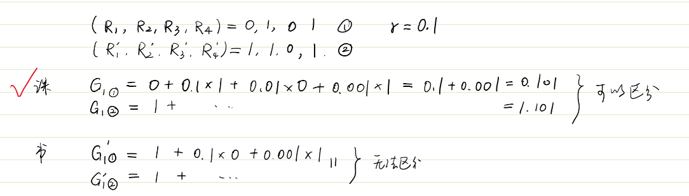
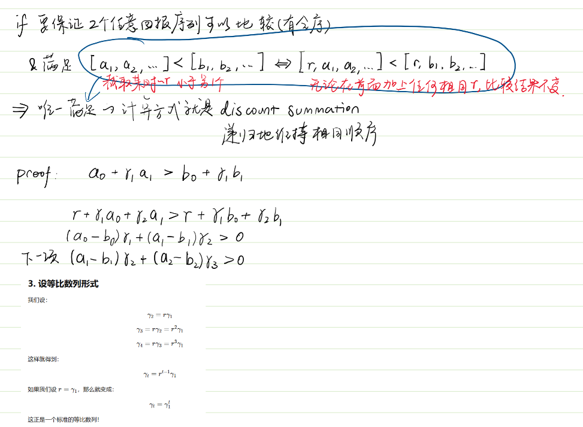
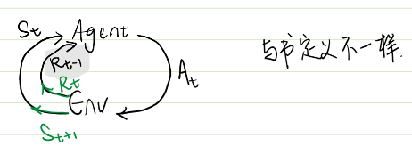
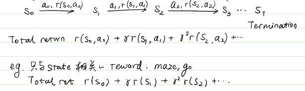
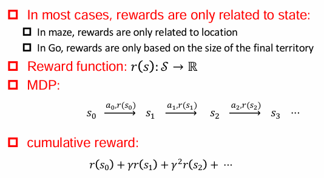
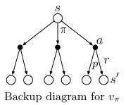
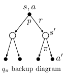
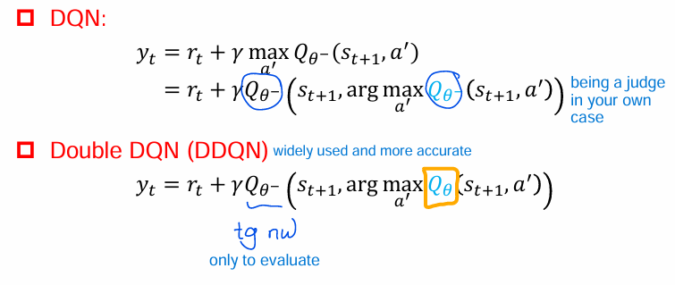
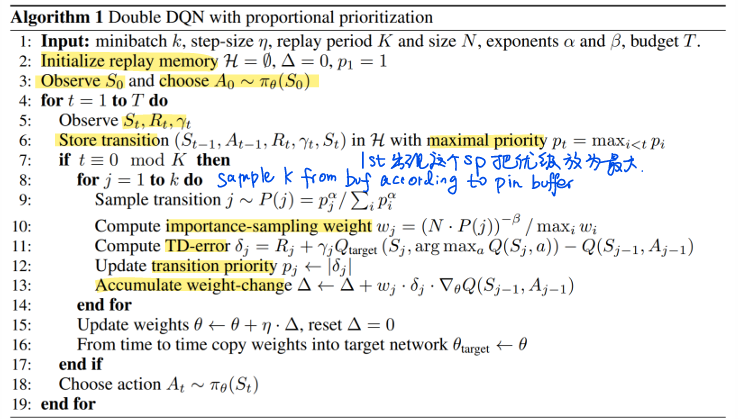

# Summary of Notation

1. Capital letters: random variables
2. Lowercase letters: values of random variables & for scalar functions.
3. **Quantities** that are required to be real-valued vectors are written in **bold** and in **lowercase** (even if random variables). Matrices are bold capitals.
4. Abbreviations: - for disadvantages, + for advantages, sol for solution, nw for network

## Symbols

- $\overset{.}{=}$: equality relationship that is true by definition
- $\approx$: approximately equal
- $\propto$: proportional to
- $Pr\{X = x\}$: probability that a random variable $X$ takes on the value $x$
- $X \sim p$: random variable $X$ selected from distribution $p(x)$
- $E[X]$: expectation of a random variable $X$, i.e.,
  $E[X] \overset{.}{=} \sum_x p(x)x$
- $\arg\max_{a} f(a)$: a value of $a$ at which $f(a)$ takes its maximal value
- $\ln x$: natural logarithm of $x$
- $e^x$: the base of the natural logarithm, $e \approx 2.71828$, carried to power $x$; $e^{\ln x} = x$
- $\mathbb{R}$: set of real numbers
- $f: X \to Y$: function $f$ from elements of set $X$ to elements of set $Y$
- $(a, b]$: the real interval between $a$ and $b$ including $b$ but not including $a$

## Parameters

- $\epsilon$: probability of taking a random action in an $\epsilon$-greedy policy
- $\alpha, \beta$: step-size parameters
- $\gamma$: discount-rate parameter
- $\lambda$: decay-rate parameter for eligibility traces
- $\mathbb{1}_\text{predicate}$:  indicator function. = 1 if the predicate is true, else 0.

# 1 Introduction

$\color{orange}\text{Apporximations for value f, policy, models}$

Even if the agent has a complete and accurate environment model, the agent is typically unable to perform enough computation (memory) per time step to fully use it.

# 2 Multi-Armed Bandit Problem

- $k$: number of actions (arms)
- $t$: discrete time step or play number
- $q_*(a)$: true value (expected reward) of action $a$
- $Q_t(a)$: estimate at time $t$ of $q_*(a)$
- $N_t(a)$: number of times action $a$ has been selected up to time $t$
- $H_t(a)$: learned preference for selecting action $a$ at time $t$
- $\pi_t(a)$: probability of selecting action $a$ at time $t$
- $\bar{R}_t$: estimate at time $t$ of the expected reward given $\pi_t$

# 3 Markov Decision Process

TODO: 寻找最优$\color{turquoise} \pi$的方法。

### 3.1 MDP concepts

The reinforcement learning agent and its environment interact over a sequence of discrete time steps. Everything inside the agent is completely known and controllable by the agent; everything outside is incompletely controllable but may or may not be completely known. The agent’s objective is to maximize the amount of reward it receives over time.

white-box environment -> the optimal policy can be solved by the dynamic programming: PI, VI

black-box -> model-free RL methods

- $t$: discrete time step.
- $\color{turquoise}\text{s, s' : current state, next state}$,  $\color{turquoise}\text{basis for making the choices}$
- $a$: an action made my the agent
- $\color{turquoise}\text{ r}$: a reward, $\color{turquoise}\text{basis for evaluating the choices}$
- $S$: set of all nonterminal states
- $S^+$: set of all states, including the **terminal state**
- $A(s)$: set of all actions available in state $s$
- $R$: set of all possible rewards, a finite subset of $\mathbb{R}$
- $\rho \subseteq \mathbb{R}$: subset of $\mathbb{R}$
- $|S|$: number of elements in set $S$
- $T, T(t)$ final time step of an episode; the episode including time step t.
- $A(t)$ : Action at t
- $S(t)$ : state at t
- $R(t)$ : reward at t
- $\color{turquoise} \pi$: policy (stochastic decision-making rule),is a $\color{turquoise}\text{mapping from states to actions}$
- $\pi(s)$ : action taken in state s under deterministic policy $\pi$
- $\pi(a|s)$ : <mark> probability </mark> of taking action a in state s under stochastic policy $\pi$

$\color{orange}\text{Stochastic process}$: 1/more events, stochastic(dynamic) system/phenomenon evovle with t.

$$
P[S_\text{t+1}|S_1,...,S_t]
$$

$\color{orange}\text{Markov process }$

- <S state,P>
- a stochastic process
- with Markov property:The current state is the future sufficient statistics (充分统计量). $(future \bot past)|present$

$$
P[S_\text{t+1}|S_t]=P[S_\text{t+1}|S_1,...,S_t]
$$

$\color{orange}\text{Markov reward process(MRP)}$

- < S, P, r reward, $\gamma$ discount>
- env: 不受agent控制，产生s,r
- episodes: agent–environment interaction breaks naturally into subsequences, each episode ends in a special state called the terminal state.
- $\color{orange}\text{discounted episode's return from }s_t$

$$
G_t= R_\text{t}+\gamma R_\text{t+1}+\gamma^2R_\text{t+2}+...=\sum_{k=0}^{\infty} \gamma^kR_\text{t+k}=R_\text{t}+\gamma G_\text{t+1}
$$

$\gamma \in[0,1]$, which helps to converge.

Comparing the G here and the one in book ($G_t'= R_\text{t+1}+\gamma R_\text{t+2}+\gamma^2R_\text{t+3}+...+R_\text{T}=\sum_{k=0}^{\infty} \gamma^kR_\text{t+k+1}$), G here makes sure the total order of episodic return for all different return sequences.




$\color {orange}\text{Markov decision process (MDP)}$

- <S,A,P,r,$\gamma$>
- state transfer function $p(s'| s, a)= Pr\{S_t=s' | S_\text{t-1}=s, A_\text{t-1}=a\}$
- reward function r(s,a)

  
- dynamics: MDP stochastic transition, to next state $s～P(·|s_0,a_0)$. dot (⋅) represents any possible next state

  



$\color {orange}\text{Policy }\pi(a|s)=P(a|s) $

- prob of taking action a in state s
- Markov property: policy needs to be related to current s;does not consider historical s.
- For 2 kinds of policies:

$$
\sum_a \pi(a|s)=1
$$

- deterministic policy:for a given s, the agent always chooses the same a, without any randomness or probabilities involved.

$$
\pi(a \mid s)=\pi(s)=\mu(s)=\begin{cases}1 & \text{if } a = \mu(s) \\0 & \text{otherwise} \end{cases}
$$

- stochastic policy: a is sampled

$$
\pi(a \mid s)\in[0,1]
$$

$\color {orange}\text{MDP to MRP: marginalization}$

- MRP是MDP的简化版本，去掉了动作部分，只关注状态转移、奖励函数和折扣因子（γ）。
- 这有助于分析和处理那些不需要明确决策行为的系统，或者是MDP的价值评估阶段。
- 在每个状态下，按照某个策略选择动作后，状态的转移概率:

$$
P(s'| s)=\sum_a \pi(a|s)P(s'| s, a)
$$

- reward at s

$$
r(s)=\sum_a \pi(a|s)r(s,a)
$$

So, MRP <S,P',r',$\gamma$>

$\color {orange}\text{Data distribution}$

- Given the same MDP, the state-action(s-a) distribution sampled by different policy is different.
- Obeserving the path of MDP...
- state dist $d^\pi(s)=\sum_{t=0}^{\infty}P(s|\pi)$
- state-action dist $d^\pi(s,a)=\sum_{t=0}^{\infty}P(s,a|\pi)$
- Relationship

$$
d^\pi(s)=\sum_ad^\pi(s,a) \\ d^\pi(s,a)=d^\pi(s)\pi(a|s)\text{  (Bayes)}
$$

$\color {orange}\text{State-action occupancy measure}$

- describes how often a policy visits certain state-action pairs in a Markov Decision Process (MDP).
- provides a way to express the long-term distribution of states and actions under a given policy.
- Discounted state-action distribution:

$$
\hat{\rho}^\pi(s, a) = \mathbb{E}_n \left[ \sum_{t=0}^{\infty}\gamma^t \mathbb{I}(s,a)\bigg| S_t = s, A_t = a \right] \quad \forall s \in S, a \in \mathcal{A} \\ = \sum_{t=0}^{\infty} \gamma^t P(s,a|\pi)
$$

- Discounted state distribution:

$$
\hat{v}^\pi(s) = \sum_{t=0}^{\infty} \gamma^t \mathbb{P}(S_t = s | \pi)
\\= \sum_{t=0}^{\infty} \gamma^t \mathbb{P}( s | \pi) \sum_a \pi(a|s)
\\ = \sum_{t=0}^{\infty} \sum_a \gamma^t \mathbb{P}( s | \pi) \sum_a \pi(a|s)
\\ = \sum_a \sum_{t=0}^{\infty} \mathbb{P}( s,a | \pi)
\\ = \sum_{t=0}^{\infty} \hat{\rho}^\pi(s, a)
$$

- Normalization (When ($\gamma$ < 1\)): two distribution above -> real dist

$$
\sum_{s} \hat{v}^\pi(s) = \sum_{s} \sum_{t=0}^{\infty} \gamma^t \mathbb{P}(s | \pi)
\\ = \sum_{t=0}^{\infty} \sum_{s}\gamma^t\mathbb{P}(s| \pi)
\\ = \sum_{t=0}^{\infty}\gamma^t
\\ = \frac{1}{1-\gamma}
$$

- Normalized Discounted (Action-) State Distribution:

$$
v^\pi(s) = (1 - \gamma) \hat{v}^\pi(s) \\
\rho^\pi(s,a) = (1 - \gamma) \hat{\rho}^\pi(s,a)
$$

- relationship

$$
\rho^\pi(s,a)=v^\pi(s)\pi(a|s) \\ v^\pi(s)=\sum_a \rho^\pi(s,a)
$$

- Theorem 1: $\rho^{\pi_1}=\rho^{\pi_2} \text{ iff } \pi_1=\pi_2$
- Theorem 2: $\pi_\rho(s|a) = \frac{\rho(s,a)}{sum_a \rho^\pi(s,a)}$

  - Given occupancy measure 𝜌, The only policy that can generate this occupancy metric is this formula.
- Policy on occupancy measure

  - policy cummulative reward

$$
J(\pi)=E_\pi[\sum_{t=0}^{\infty}\gamma^t r(S_t,A_t)]
\\ = \sum_{t=0}^{\infty}\gamma^t E_\pi[r(S_t,A_t)]
\\ = \sum_{t=0}^{\infty}\gamma^t \sum_a \sum_s P(s,a|\pi) {\color{red}\text{r(s,a)}}
\\ = \sum_a \sum_s {\color{green}[\sum_{t=0}^{\infty} \gamma^tP(s,a|\pi)]} {\color{red}\text{r(s,a)}}
\\ = \sum_a \sum_s {\color{green}\hat{\rho}^\pi(s, a)}{\color{red}\text{r(s,a)}}
\\ = E_{(s,a)～\hat\rho^\pi}[r(s,a)]
$$

- Policy learning goal

$$
\max_\pi J(\pi)=E_\pi[\sum_{t=0}^{\infty}\gamma^t r(S_t,A_t)] ≃ E_{(s,a)～\hat\rho^\pi}[r(s,a)]
$$

$\color{orange}\text{Bellman expectation equations }$

- $V^\pi(s)$: Expected reward by following policy $\pi$ from state s
- $Q^\pi(s, a)$: Expected reward while following policy $\pi$ from state s and take action a
  - q: quality

$$
V^\pi(s) = E_\pi[G_t|s]  \text{ def}
\\ = E_\pi[R_t + \gamma G_{t+1}|s]
\\ = E_\pi[R_t|s]+ E_\pi[\gamma G_{t+1}|s]
\\ = E_\pi[R_t|s]+ \gamma E_\pi[G_{t+1}|s]
\\ = E_\pi[R_t|s]+ \gamma V^\pi(s_{t+1})
\\ = E_\pi[R_t|s]+ E_\pi[\gamma V^\pi(s_{t+1})|s]
\\ = \sum_a \pi(a|s)r(s,a) + \sum_a \pi(a|s)\gamma\sum_{s_{t+1}} P(s_{t+1}|s,a) V^\pi(s_{t+1})
\\ = \sum_a \pi(a|s)(r(s,a) + \gamma\sum_{s_{t+1}} P(s_{t+1}|s,a) V^\pi(s_{t+1}))
\\ = \sum_a \pi(a|s)Q(s,a)
$$

$$
Q^\pi(s,a) = E_\pi[G_t|s,a]
\\ = E_\pi[R_t + \gamma G_{t+1}|s,a]
\\ = E_\pi[R_t + \gamma Q(S_{t+1},A_{t+1})|s,a]
\\ = E_\pi[R_t|s,a]+ E_\pi[\gamma Q(S_{t+1},A_{t+1})|s,a]
\\ = r(s,a) + \gamma \sum_{s_{t+1}} P(s_{t+1}|s,a) \sum_{a_{t+1}} \pi(a_{t+1}|s_{t+1})Q(s_{t+1},a_{t+1})
$$

- $\color{pink}\text{Explanations}$ The value function $V_\pi$ 's Bellman equation.



```text
Starting from state s, the root node at the top, the agent could take any of some set of actions (e.g.3) based on its policy pi. 
From each of these, the environment could respond with one of several next states, s0 (e.g.2), 
along with a reward, r, depending on its dynamics given by the function p.
```

- The action-value function $Q_\pi$ 's Bellman equation.



```text
If we were to take action 𝑎 in state 𝑠, what is the expected return if we then follow 𝜋 afterward?
```

### 3.2 Policy evaluation

$\color{orange}\text{Policy improvement theorem}$

Assume deterministic policy $\pi$
Policy $\pi'$ is the improvement of $\pi$ if: for any s, $Q^\pi(s, \pi') \ge V^\pi(s)$

Then $\pi \text{ and } \pi'$ satisfy: for any s, $V^{\pi'}(s) \ge V^\pi(s)$

$\color{Lime} \text{PROOF 28}$

### 3.3 Find optimal policy

#### 3.3.1 Policy iteration

Given a MDP with limited action space and state space: $|S| < \infty, |A| < \infty$

- PI based on s value V

  1. Randomly initialize policy 𝜋
  2. Repeat until convergence {
     a) Calculate 𝑉 ≔ 𝑉^𝜋 (Updating is time consuming)
     b) For each state 𝑠 ∈ 𝒮, update:

$$
\pi(s) = arg \max_a r(s,a) + \gamma \sum_{s'}P(s'|s,a)V(s')
$$

}

- PI based on action value Q

  1. Randomly initialize policy 𝜋
  2. Repeat until convergence {
     a) Calculate Q ≔ Q^𝜋 (Updating is time consuming)
     b) For each state 𝑠 ∈ 𝒮, update:

$$
\pi(s) = arg \max_a Q(s,a)
$$

}

- $\color{Lime} \text{PROOF 35,36at k}$

#### 3.3.2 Value iteration $\color{Lime} \text{+e.g.}$

**Speed up V, same for Q:**
Policy evaluation is time consuming.  But in the previous example, when the iteration of value function V is not  convergent, the derived policy is already optimal. Don’t wait until convergence!  If only one round of value  update is carried out in the  policy evaluation, and then the policy is upgraded  directly according to the updated value.

1. For each state, initialize V(s)=0
2. Repeat until convergence {
   a) For each state 𝑠 ∈ 𝒮, update:

$$
V(s) = arg \max_a r(s,a) + \gamma \sum_{s'}P(s'|s,a)V(s')
$$

}
3. Return a deterministic policy

$$
\pi(s) = arg \max_a r(s,a) + \gamma \sum_{s'}P(s'|s,a)V(s')
$$

Synchronous value iteration store two copies of value function (Update new by using old)
Asynchronous value iteration only store one copy of value function (Update new by using both old and new)

#### 3.3.3 Optimal policy $\pi^*$

In MDP with limited state and action  space, there is a policy:

$V^{\pi^*}(s)\ge V^{\pi}(s) \text{ for any s} \in S$

Optimal state value f

$$
V^{*}(s) = \max_\pi V^\pi(s) 
\\ = \max_\pi \sum_a \pi(a|s)Q^\pi(s,a) 
\\ = \max_aQ^*(s,a) 
\\ = \max_a r(s,a) + \gamma \sum_{s'}P(s'|s,a)V^*(s')
$$

Optimal action value f

$$
Q^{*}(s,a) = \max_\pi Q^\pi(s,a)
\\ = r(s,a) + \gamma \sum_{s'}P(s'|s,a)V^*(s')
\\ = r(s,a) + \gamma \sum_{s'}P(s'|s,a)\max_a Q^*(s,a)
$$

When value function is optimal, its policy is optimal:

$$
\pi^*(s) = arg \max_a r(s,a) + \gamma \sum_{s'}P(s'|s,a)V^*(s')
$$

relationship

$\color{Lime} \text{Proof: Value Iteration}$

### 3.4 Policy v.s. Value Iteration

Value iteration: greedy update method, equivalent to a round of value update in policy evaluation, and then the policy is upgraded directly according to the updated value

In policy iteration, the cost of updating value function by using Bellman equation is very large!

For MDP with small space, policy iteration usually converges quickly

For MDP with large space, value iteration is more practical, more efficient

If no state transition loop, best to use value iteration

### 3.5 Model-based method

MDP<S,A,P,r,$\gamma$>.
In real applications, 𝑃 and 𝑟 are unknown.

Need to learn the state transition probability P and reward r

$$
P(s'|s,a)=\frac{\text{\# take a under s and transfer to s'}}{\text{\# take a under s}}
$$

$$
r(s,a)= \text{avgerage } {r(s,a)^{(i)}}
$$

Algorithm

1. Randomly initialize policy 𝜋
2. Repeat untFil convergence {
   a) Execute 𝜋 in MDP, collect experienced data
   b) Use the collected experience in MDP to update the estimation of 𝑃 and 𝑟
   c) Value iteration by using the estimation of 𝑃 and 𝑟 to get new estimation of value function V
   d) Update policy 𝜋 as greedy policy according to V
   }

-: action space is too large. -> model-free

# 4 Model-free method

If a problem cannot be modeled as MDP, it is not a reinforcement learning problem.
Can be modeled does not mean that we know all the parameters.

1. Learn value function and policy directly from experiences.
   Key steps:

(1) Estimating value function (Policy evaluation)

(2) Optimizing policy (Policy improvement)

2. 2 kinds of policy learning

   on-policy learning:Sampling policy and learning policy is the same!

   off-policy: Sampling policy and learning policy is different!

   - target policy $\pi(a|s)$: evluate value function $V^\pi(s)$ or $Q^\pi(s,a)$
   - Behavior policy $\mu(a|s)$: collect data $\{s_t,a_t,r_t, s_{t+1},...,s_{T-1},a_{T-1},r_{T-1},s_T,a_T,r_T \}～\mu$
   - why:
     - Balance exploration and exploitation
     - Learning policy by observing human beings or other agents
     - Experience from reusing old policies
     - Learn the optimal policy when following the policy used in exploration
     - Learn multiple policies when following one policy in exploration
     - An example of MSR research in Cambridge

#### 4.1 Monte Carlo value estimation

MC: repeated random sampling to obtain numerical results.
can only be applied to MDP with finite length (all episode has a terminate state).
learns from the complete episode: no bootstrapping

work in a fragmented (terminated) environment.

must wait for the end of the episode until the cumulative reward is  known

Steps:

1. Sampling a lot of episodes using policy $\pi$
2. For the state 𝑠 of each time step 𝑡 in each episode:Incremental counter 𝑁(𝑠) ←𝑁(𝑠) +1

   Incremental total cumulative reward 𝑀(𝑠) ←𝑀(𝑠) + 𝐺𝑡

   Value is estimated as the average of the cumulative rewards 𝑉(s)=  𝑀(𝑠)/𝑁(𝑠)
3. According to the law of large numbers: $V(s) -> V^\pi(s) \text{ as } N(s) -> \infty$

   Update 𝑉(𝑠) immediately after sampling an episode
4. For each state $𝑠_𝑡$ and its cumulative reward $g_t$

   $$
   N(s_t) \leftarrow N(s_t) +1
   \\ V(s_t) \leftarrow V(s_t) + \frac{1}{N(s_t)}(g_t-V(s_t))
   $$

   For nonn-stationary problems (that is, the environment will change over time), we can track a current average (that is, we don't consider episodes that are too long ago). Take $\alpha$ as a constant.

   $$
   V(s_t) \leftarrow V(s_t) + \alpha(g_t-V(s_t))
   $$

Analysis:

The cummulative reward $g_t$ is the unbiased estimation of $V(s_t)$

 Good convergence property (This is still true when using functional  approximation)
 Insensitive to initial values
 Easy to understand and use

#### 4.2 Temporal difference

By bootstrapping, TD learns from incomplete fragment.

updates the current prediction value to make it close to  the estimated cumulative reward (untrue value).

works in a continuous (non-terminating) environment.

can do real-time learning at each step. 


Steps:

1. Update value function $V(s_t)$, make it close to the estimated cummulative reward (TD target) $r_t+\gamma V(s_{t+1})$. the braket content in the $\alpha$ is the TD error.

$$
V(s_t) \leftarrow V(s_t) + \alpha(\color{green}{r_t+\gamma V(s_{t+1})}- \color{orange}V(s_t))
$$

Analysis:

Real target $r_t+\gamma V^\pi (s_{t+1})$ is the unbiased estimation of $V(s_t)$

TD target $r_t+\gamma V(s_{t+1})$ is biased, $\gamma V(s_{t+1})$ is the current estimation

TD target has a lower variance:

 Cumulative reward: depend on multi-step random action, multi-step state  transition and multi-step reward   TD target: depend on single-step random action, single-step state transition and single-step reward

 Usually more efficient than MC

 TD finally converges to $𝑉^\pi (𝑠_{𝑡+1})$ (but it is not always the case when using function approximation)

 More sensitive to initial values than MC

#### 4.3 Multi-step TD Learning

* Instead of updating based on a single reward, we update using a sum of rewards over **𝑛** steps.
* This helps balance between **speed (shorter horizon)** and **accuracy (longer horizon)**.
* It is useful when time constraints make full-episode learning impractical.
* The update rule still remains model-free because it doesn’t rely on knowing the full environment dynamics.

𝑛 step cummulative reward:

$$
g_t^{(n)}= r_\text{t}+\gamma r_\text{t+1}+...+\gamma^{n-1} R_\text{t+n-1}++\gamma^{n} R_\text{t+n}
$$

𝑛 step TD learning:

$$
V(s_t) \leftarrow V(s_t) + \alpha(g_t^{(n)}-V(s_t))
$$

#### 4.4 Off-policy MC by importance sampling

Evaluate policy 𝜋 using the cumulative rewarded generated by policy 𝜇

Cumulative reward 𝑔𝑡 should be weighted according by the importance ratio between two policies:

$$
\{s_t,a_t,r_t, s_{t+1},...,s_{T-1},a_{T-1},r_{T-1},s_T,a_T,r_T\}～\mu
\\g_t^{\pi/\mu}=\frac{\pi(a_t|s_t)}{\mu(a_t|s_t)}\frac{\pi(a_{t+1}|s_{t+1})}{\mu(a_{t+1}|s_{t+1})}...\frac{\pi(a_T|s_T)}{\mu(a_T|s_T)}g_t=
$$

Update value function to approximate revised cumulative reward.

Cannot be used when 𝜋≠0 but 𝜇=0; and significantly increase variance.

$$
V(s_t) \leftarrow V(s_t) + \alpha(g_t^{\pi/\mu}-V(s_t))
$$

.

#### 4.4 Off-policy MC by importance sampling

TD target is weighted by the importance sampling

$$
V(s_t) \leftarrow V(s_t) + \alpha \left( \frac{\pi(a_t | s_t)}{\mu(a_t | s_t)} (r_t + \gamma V(s_{t+1})) - V(s_t) \right)
$$

Lower variance than MC importance sampling.

The policy only needs to be approximated in a single step.
.

#### 4.5 Policy optimization methods


1. $\epsilon$ greedy policy improvement
2. MC control

   - on-policy
   - off-policy
     MC Control v.s TD Control
3. SARSA (state-action-reward-state-action) On-Policy Control
   policy evaluation:

   $$
   Q(s,a) \leftarrow Q(s,a)+\alpha (r+\gamma Q(s',a')-Q(s,a))
   $$

   policy improvement: $\epsilon$-greedy
4. Q-learning (off-policy)
   SARSA v.s. Q-learning


#### 4.6 Summery


Model-free RL

- On-policy MC: 
  $$
  V(s_t) \leftarrow V(s_t) + \alpha (g_t - V(s_t))
  $$
- On-policy TD: 
  $$
  V(s_t) \leftarrow V(s_t) + \alpha (r_t + \gamma V(s_{t+1}) - V(s_t))
  $$
- On-policy TD (SARSA):
  $$
  Q(s_t, a_t) \leftarrow Q(s_t, a_t) + \alpha (r_t + \gamma Q(s_{t+1}, a_{t+1}) - Q(s_t, a_t))
  $$

Off-policy TD (Q-learning):

$$
Q(s_t, a_t) \leftarrow Q(s_t, a_t) + \alpha (r_t + \gamma \max_{a'} Q(s_{t+1}, a') - Q(s_t, a_t))
$$


# 5 Multi-step bootsr

折中4, 采样几步就更新几次，剩下的值函数估计

# 6 Value-based DRL

这一讲终于跳脱出了前面传统的强化学习（解决相对简单的问题），用神经网络拟合Q, V函数，适用于更大的状态空间。

$\large \color{violet}\text{DQN family}$

Q-Learning: learns a function $Q_\theta(s,a)$ with para $\theta$

- given a segment {(s,a,s',r)}
- $\color{turquoise}\text{target }$ $y=r+\gamma max_\text{a'}Q_\theta(s',a')$
- update:

  $$
  Q_\theta(s,a) \leftarrow Q_\theta(s,a)+\alpha(r+\gamma \max\limits_{a'}Q_\theta(s',a')-Q_\theta(s,a))
  $$

  α后面类似梯度下降
- optimization objective:

  $$
  \theta^* \leftarrow arg \min_\theta E_\text{(s,a,s',r) ∼ U(D)} \frac{1}{2}[(r+\gamma \max\limits_{a'}Q_\theta(s',a'))-Q_\theta(s,a)]^2
  $$

  - $(r+\gamma max_\text{a'}Q_\theta(s',a')$ TD target, no gradient here???
  - $\text{(s,a,s',r) ∼ U(D)}$: a transition **(state, action, next state, reward)** is **randomly sampled** from the replay buffer D using a **uniform distribution** **U**.
  - $Q_\theta(s',a')$ 如果不固定，会连续更新，不稳定

$\color{orange}\text{Deep Q-Networks (DQN)}$ represents Q function $Q_\theta(s,a)$ by using neural networks.

- Input:s.   Not（s,a), because too large
- Last layer: a.  #of elements $|A|$
- Output:(s,a)

-:

- unstable
  - continuously sampled (s,a,s',r) is not IID
  - $Q_\theta(s',a')$ updates freq
- output is discrete (only fit for discrete action space)

sol:

- Experience replay: non IID data -> IID data
  - Store sample $e_t = (s_t, a_t, s_\text{t+1}, r_t)$ in each step of training INTO replay buffer D.
  - Sampling, uniformly distributed
- Build 2 nw:
  - Evaluations nw: $Q_\theta(s,a)$
  - Target nw $Q_{\theta^-}(s,a)$ to compute TD target: synchronize with the evaluation nw every C step

    - $\color{turquoise}\text{target }$ $y=r+\gamma \max\limits_{a'} Q_{\theta^-}(s',a')$

**Algorithm:**

1. Randomly initialize evaluation network $\theta; \theta^- \leftarrow \theta$
2. Initialize experience replay buffer D
3. Repeat until convergence{

- Get initial state $s_0$
- For each step t=0,1,...,T

  - take action $a_t$ by $\epsilon$-greedy based on $Q_\theta$
  - Get reward $r_t$ and the next state $s_{t+1}$
  - Store ($s_t, a_t, s_{t+1}, r_t$) in D
  - If D is large enough, sampling N samples $\{(s_t, a_t, s_{t+1}, r_t)\}^N_{i=1}$
  - For each sample, calculate target $y_i =r_i+ \gamma \max\limits_{a'} Q_{\theta^-}(s_{i+1},a')$
  - Update $\theta$ by minimize loss $L = \frac{1}{2N}\sum_i(y_i-Q_\theta(s_i,a_i))^2$
  - If t mod C=0, then update $\theta^- \leftarrow \theta$
    }

$\color{orange}\text{Double DQN (DDQN)}$,improved version of DQN

Due to the Jensen's inequality, max operation makes the est Q always larger than real Q value. And it will be more serious when #candidate actions increase.

$$
E[\hat Q(s,a)]=Q(s,a) \\E[\max\limits_{a} \hat Q(s,a)] \ge \max\limits_{a} Q(s,a)
$$

$$
\max\limits_{a'}Q_{\theta^-}(s',a')=Q_{\theta^{-}}(s', arg \max\limits_{a'}Q_{\theta^-}(s',a')) \\=E[R|s', arg \max\limits_{a'}Q_{\theta^-}(s',a'),{\theta^-}] \\ \ge \max(E[R|s', a_1,{\theta^-}], E[R|s', a_2,{\theta^-}],...  a_i \in A
$$

$$
\text{Where } E[\max(X_1, X_2)] \ge \max(E[X_1], E[X_2])
$$

In DDQN, $Q_\theta$ is used to select next action.



$\color{pink}\text{Prioritized Experience Replay}$ : find more experience samples

Calculate the priority $p_t$ (value of learning)

$$
p_t = |r_t + \gamma Q_{\theta^-}(s_{t+1}, arg \max\limits_{a'}Q_\theta(s_\text{t+1},a'))-Q_\theta(s_t,a_t)|
$$

Store experience $e_t = (s_t, a_t,s_\text{t+1},r_t, p_t+\epsilon)$ , $\epsilon$ is the noise for randomness, in replay buffer to give each sample a chance to be sampled.

Prob of $e_t$ being selected is $P(t)=(p_t^\alpha)/(\sum_kp_k^\alpha)$. α for smoothing. (=0 in uniform sampling)

Weight in importance sampling $w_t=(N\times P(t))^{-\beta}/(\max\limits_{i} w_i)$



$\color{orange}\text{Dueling DQN}$, improved version of DQN. parallel with DDQN

Inputs of s are processed by CNN to extract features.

Core:Advantage funciton A

$$
A^\pi(s,a)=Q^\pi(s,a)-V^\pi(s)\\Q^\pi(s,a)=E[G_t|s,a]\\V^\pi(s)=E_{a  ∼ \pi(·|s)}[Q^\pi(s,a)]
$$

$V^\pi(s) \text{ is the avagerage value of }Q^\pi(s,a)\text{. }A^\pi(s,a) \text{ measures the effect after taking an action.}$

To obtain V, A separately (fc layer), Q in the DQN is decomposed. And they are combined into Q finally. *Subscript denotes parameters.*

$$
Q_{\theta,\alpha,\beta}(s,a) = V_{\theta,\alpha}(s)+A_{\theta,\beta}(s,a)
$$

However, this version is unstable in training because the non-uniqueness in modeling V and A.

For sol 1, max two sides of Q=V+A (max limits a only operates the f with para a), define the optimal A function($\max\limits_aA(s,a)-\max\limits_aA(s,a)$) equals to 0.

$$
Q(s,a)=V(s)+A(s,a) \\ \max\limits_aQ(s,a)=V(s)+\max\limits_aA(s,a)-\max\limits_aA(s,a)\\V(s)=\max\limits_aQ(s,a)
$$

So is the sol 2.

Therefore the two sols:

1.Set $V_{\theta,\alpha}(s)=\max\limits_{a'}Q_{\theta,\alpha,\beta}(s,a')$

$$
Q_{\theta,\alpha,\beta}(s,a) = V_{\theta,\alpha}(s)+A_{\theta,\beta}(s,a)-\max\limits_{a'}A_{\theta,\beta}(s,a')
$$

2. Set $V_{\theta,\alpha}(s)=\frac{1}{|A|}\sum_{a' \in A}Q_{\theta,\alpha,\beta}(s,a')$

$$
Q_{\theta,\alpha,\beta}(s,a) = V_{\theta,\alpha}(s)+A_{\theta,\beta}(s,a)-\frac{1}{|A|}\sum_{a' \in A}A_{\theta,\beta}(s,a')
$$

The sol ensure the uniqueness of V function,

but not satisfy with the Bellman f, the outputs of A,V,Q of the network are no longer the real A,V,Q.

We do not care of it, because the standard of doing greedy is the order of Q.

The relative order of Q remains the same. s.t.$Q(s,a_1) > Q(s,a_2) \rightarrow A(s,a_1) > A(s,a_2)$$

+ +:
  + Handle states that are less associated with actions. 没人的路上怎么开都行。
  + effective in learning state-value f: one state  value function corresponds to multiple Advantage. functions. Share the same state-value function; Easy Training, fast convergence.

# dft

Approximate Value Functions

- $v_\theta(s)$: approximate value of state $ s $ given parameter vector $ \theta $
- $q_\theta(s, a)$: approximate value of state-action pair $ (s, a) $ given parameter vector $ \theta $
- $\nabla v_\theta(s)$: column vector of partial derivatives of $ v_\theta(s) $ with respect to $ \theta $
- $\nabla q_\theta(s, a)$: column vector of partial derivatives of $ q_\theta(s, a) $ with respect to $ \theta $

#### Bellman Operators

- $B_\pi$: Bellman operator for value functions
- $P$: state-transition probability matrix under $ \pi $
- $D$: diagonal matrix with on-policy state distribution on its diagonal
- $X$: feature matrix, with $ x(s) $ as its rows
- $\Pi$: projection operator for value functions

## Missing Symbols and Notation

Below are the missing symbols and notation that were not properly formatted in the original document:

## Symbols

- $\mathbb{R}$: set of real numbers
- $f : X \to Y$: function $f$ from elements of set $X$ to elements of set $Y$
- $(a, b]$: the real interval between $a$ and $b$ including $b$ but not including $a$
- $\in$: is an element of; e.g., $s \in S, r \in R$
- $\subseteq$: subset of; e.g., $R \subseteq \mathbb{R}$
- $|S|$: number of elements in set $S$

## Temporal Difference Learning

- $\delta_t$: temporal-difference (TD) error at time $t$
- $\delta_t^s, \delta_t^a$: state- and action-specific forms of the TD error
- $n$: in n-step methods, $n$ is the number of steps of bootstrapping

## Eligibility Traces

- $w, w_t$: weight vector in function approximation
- $\mathbf{w}, \mathbf{w}_t$: weight vector notation
- $x(s)$: vector of features visible in state $s$
- $x(s, a)$: vector of features visible in state $s$ taking action $a$
- $\mathbf{x}(s)$, $\mathbf{x}(s, a)$: feature vectors in bold
- $\mathbf{w}^T \mathbf{x}$: inner product of weight vector and feature vector

## Policy Gradient Methods

- $\theta, \theta_t$: parameter vector of target policy
- $\pi(a | s, \theta)$: probability of taking action $a$ in state $s$ given parameter $\theta$
- $\nabla \pi(a | s, \theta)$: gradient of policy function
- $J(\theta)$: performance measure for policy $\pi_\theta$
- $\nabla J(\theta)$: gradient of performance measure
- $b(a|s)$: behavior policy used to select actions while learning about target policy $\pi$

## Importance Sampling

- $\rho_t:h$: importance sampling ratio for time $t$ through time $h$
- $\rho_t$: importance sampling ratio for time $t$ alone, $\rho_t = \rho_{t:t}$
- $r(\pi)$: average reward (reward rate) for policy $\pi$
- $\bar{R}_t$: estimate of $r(\pi)$ at time $t$

## Norms and Errors

- $\|v\|^2_{\mu}$: $\mu$-weighted squared norm of value function $v$
- $\|\delta_t\|^2$: squared temporal-difference error
- $BE(w)$: mean square Bellman error
- $PBE(w)$: mean square projected Bellman error
- $TDE(w)$: mean square temporal-difference error

# References

1. Sutton, R.,S. & Barto, A.,G. (2018). Reinforcement learning: An introduction. (2 e.d.)
2. Lecture notes by Jianxiong Guo.
