# Summary of Notation

1. Capital letters: random variables
2. Lowercase letters: values of random variables & for scalar functions.
3. **Quantities** that are required to be real-valued vectors are written in **bold** and in **lowercase** (even if random variables). Matrices are bold capitals.
4. Abbreviations: - for disadvantages, + for advantages, sol for solution, nw for network
## Symbols

- $\overset{.}{=}$: equality relationship that is true by definition
- $\approx$: approximately equal
- $\propto$: proportional to
- $Pr\{X = x\}$: probability that a random variable $X$ takes on the value $x$
- $X \sim p$: random variable $X$ selected from distribution $p(x)$
- $E[X]$: expectation of a random variable $X$, i.e.,
  $E[X] \overset{.}{=} \sum_x p(x)x$
- $\arg\max_{a} f(a)$: a value of $a$ at which $f(a)$ takes its maximal value
- $\ln x$: natural logarithm of $x$
- $e^x$: the base of the natural logarithm, $e \approx 2.71828$, carried to power $x$; $e^{\ln x} = x$
- $\mathbb{R}$: set of real numbers
- $f: X \to Y$: function $f$ from elements of set $X$ to elements of set $Y$
- $(a, b]$: the real interval between $a$ and $b$ including $b$ but not including $a$

## Parameters

- $\epsilon$: probability of taking a random action in an $\epsilon$-greedy policy
- $\alpha, \beta$: step-size parameters
- $\gamma$: discount-rate parameter
- $\lambda$: decay-rate parameter for eligibility traces
- $\mathbb{1}_\text{predicate}$:  indicator function. = 1 if the predicate is true, else 0.

# 1 Introduction

$\color{orange}\text{Apporximations for value f, policy, models}$

Even if the agent has a complete and accurate environment model, the agent is typically unable to perform enough computation (memory) per time step to fully use it.

# 2 Multi-Armed Bandit Problem

- $k$: number of actions (arms)
- $t$: discrete time step or play number
- $q_*(a)$: true value (expected reward) of action $a$
- $Q_t(a)$: estimate at time $t$ of $q_*(a)$
- $N_t(a)$: number of times action $a$ has been selected up to time $t$
- $H_t(a)$: learned preference for selecting action $a$ at time $t$
- $\pi_t(a)$: probability of selecting action $a$ at time $t$
- $\bar{R}_t$: estimate at time $t$ of the expected reward given $\pi_t$

# 3 Markov Decision Process

TODO: 寻找最优$\color{turquoise} \pi$的方法。

### 3.1 MDP concepts

The reinforcement learning agent and its environment interact over a sequence of discrete time steps. Everything inside the agent is completely known and controllable by the agent; everything outside is incompletely controllable but may or may not be completely known. The agent’s objective is to maximize the amount of reward it receives over time.

white-box environment -> the optimal policy can be solved by the dynamic programming: PI, VI

black-box -> model-free RL methods

- $t$: discrete time step.
- $\color{turquoise}\text{s, s' : current state, next state}$,  $\color{turquoise}\text{basis for making the choices}$
- $a$: an action made my the agent
- $\color{turquoise}\text{ r}$: a reward, $\color{turquoise}\text{basis for evaluating the choices}$
- $S$: set of all nonterminal states
- $S^+$: set of all states, including the **terminal state**
- $A(s)$: set of all actions available in state $s$
- $R$: set of all possible rewards, a finite subset of $\mathbb{R}$
- $\rho \subseteq \mathbb{R}$: subset of $\mathbb{R}$
- $|S|$: number of elements in set $S$
- $T, T(t)$ final time step of an episode; the episode including time step t.
- $A(t)$ : Action at t
- $S(t)$ : state at t
- $R(t)$ : reward at t
- $\color{turquoise} \pi$: policy (stochastic decision-making rule),is a $\color{turquoise}\text{mapping from states to actions}$
- $\pi(s)$ : action taken in state s under deterministic policy $\pi$
- $\pi(a|s)$ : <mark> probability </mark> of taking action a in state s under stochastic policy $\pi$

$\color{orange}\text{Stochastic process}$: 1/more events, stochastic(dynamic) system/phenomenon evovle with t.

$$
P[S_\text{t+1}|S_1,...,S_t]
$$

$\color{orange}\text{Markov process }$

- <S state,P>
- a stochastic process
- with Markov property:The current state is the future sufficient statistics (充分统计量). $(future \bot past)|present$

$$
P[S_\text{t+1}|S_t]=P[S_\text{t+1}|S_1,...,S_t]
$$

$\color{orange}\text{Markov reward process(MRP)}$

- < S, P, r reward, $\gamma$ discount>
- env: 不受agent控制，产生s,r
- episodes: agent–environment interaction breaks naturally into subsequences, each episode ends in a special state called the terminal state.
- $\color{orange}\text{discounted episode's return from }s_t$

$$
G_t= R_\text{t}+\gamma R_\text{t+1}+\gamma^2R_\text{t+2}+...=\sum_{k=0}^{\infty} \gamma^kR_\text{t+k}=R_\text{t}+\gamma G_\text{t+1}
$$

$\gamma \in[0,1]$, which helps to converge.

Comparing the G here and the one in book ($G_t'= R_\text{t+1}+\gamma R_\text{t+2}+\gamma^2R_\text{t+3}+...+R_\text{T}=\sum_{k=0}^{\infty} \gamma^kR_\text{t+k+1}$), G here makes sure the total order of episodic return for all different return sequences.
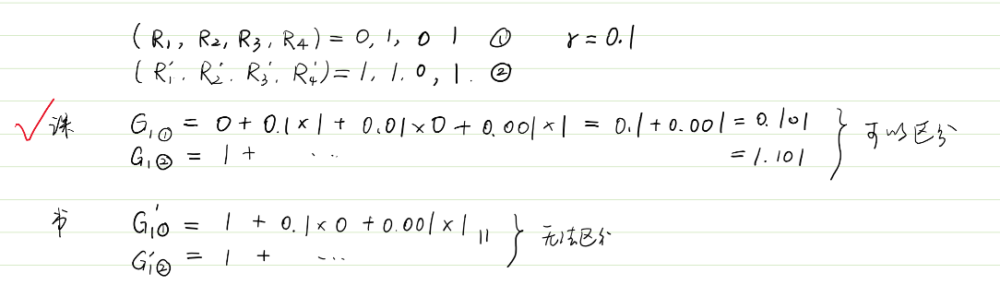

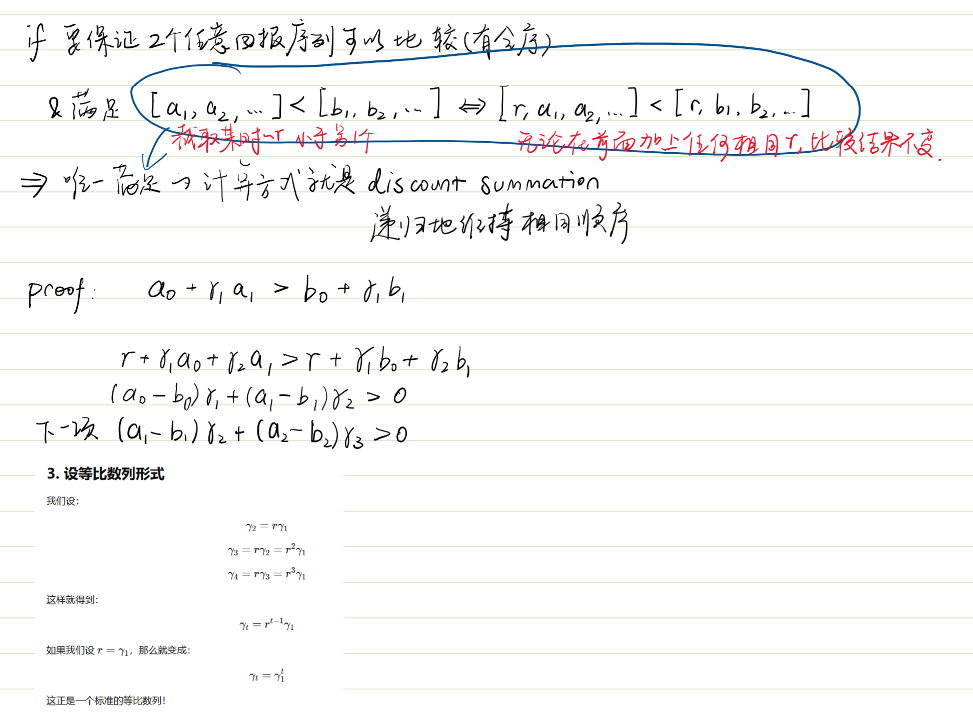

$\color {orange}\text{Markov decision process (MDP)}$

- <S,A,P,r,$\gamma$>
- state transfer function $p(s'| s, a)= Pr\{S_t=s' | S_\text{t-1}=s, A_\text{t-1}=a\}$
- reward function r(s,a)

  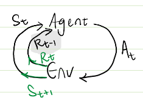
- dynamics: MDP stochastic transition, to next state $s～P(·|s_0,a_0)$. dot (⋅) represents any possible next state

  

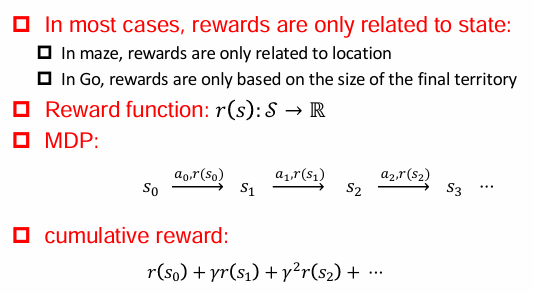

$\color {orange}\text{Policy }\pi(a|s)=P(a|s) $

- prob of taking action a in state s
- Markov property: policy needs to be related to current s;does not consider historical s.
- For 2 kinds of policies:

$$
\sum_a \pi(a|s)=1
$$

- deterministic policy:for a given s, the agent always chooses the same a, without any randomness or probabilities involved.

$$
\pi(a \mid s)=\pi(s)=\mu(s)=\begin{cases}1 & \text{if } a = \mu(s) \\0 & \text{otherwise} \end{cases}
$$

- stochastic policy: a is sampled

$$
\pi(a \mid s)\in[0,1]
$$

$\color {orange}\text{MDP to MRP: marginalization}$

- MRP是MDP的简化版本，去掉了动作部分，只关注状态转移、奖励函数和折扣因子（γ）。
- 这有助于分析和处理那些不需要明确决策行为的系统，或者是MDP的价值评估阶段。
- 在每个状态下，按照某个策略选择动作后，状态的转移概率:

$$
P(s'| s)=\sum_a \pi(a|s)P(s'| s, a)
$$

- reward at s

$$
r(s)=\sum_a \pi(a|s)r(s,a)
$$

So, MRP <S,P',r',$\gamma$>

$\color {orange}\text{Data distribution}$

- Given the same MDP, the state-action(s-a) distribution sampled by different policy is different.
- Obeserving the path of MDP...
- state dist $d^\pi(s)=\sum_{t=0}^{\infty}P(s|\pi)$
- state-action dist $d^\pi(s,a)=\sum_{t=0}^{\infty}P(s,a|\pi)$
- Relationship

$$
d^\pi(s)=\sum_ad^\pi(s,a) \\ d^\pi(s,a)=d^\pi(s)\pi(a|s)\text{  (Bayes)}
$$

$\color {orange}\text{State-action occupancy measure}$

- describes how often a policy visits certain state-action pairs in a Markov Decision Process (MDP).
- provides a way to express the long-term distribution of states and actions under a given policy.
- Discounted state-action distribution:

$$
\hat{\rho}^\pi(s, a) = \mathbb{E}_n \left[ \sum_{t=0}^{\infty}\gamma^t \mathbb{I}(s,a)\bigg| S_t = s, A_t = a \right] \quad \forall s \in S, a \in \mathcal{A} \\ = \sum_{t=0}^{\infty} \gamma^t P(s,a|\pi)
$$

- Discounted state distribution:

$$
\begin{aligned}
\hat{v}^\pi(s) &= \sum_{t=0}^{\infty} \gamma^t \mathbb{P}(S_t = s | \pi)
\\ &= \sum_{t=0}^{\infty} \gamma^t \mathbb{P}( s | \pi) \sum_a \pi(a|s)
\\ &= \sum_{t=0}^{\infty} \sum_a \gamma^t \mathbb{P}( s | \pi) \sum_a \pi(a|s)
\\ &= \sum_a \sum_{t=0}^{\infty} \mathbb{P}( s,a | \pi)
\\ &= \sum_{t=0}^{\infty} \hat{\rho}^\pi(s, a)
\end{aligned}
$$

- Normalization (When ($\gamma$ < 1\)): two distribution above -> real dist

$$
\sum_{s} \hat{v}^\pi(s) = \sum_{s} \sum_{t=0}^{\infty} \gamma^t \mathbb{P}(s | \pi)
\\ = \sum_{t=0}^{\infty} \sum_{s}\gamma^t\mathbb{P}(s| \pi)
\\ = \sum_{t=0}^{\infty}\gamma^t
\\ = \frac{1}{1-\gamma}
$$

- Normalized Discounted (Action-) State Distribution:

$$
v^\pi(s) = (1 - \gamma) \hat{v}^\pi(s) \\
\rho^\pi(s,a) = (1 - \gamma) \hat{\rho}^\pi(s,a)
$$

- relationship

$$
\rho^\pi(s,a)=v^\pi(s)\pi(a|s) \\ v^\pi(s)=\sum_a \rho^\pi(s,a)
$$

- Theorem 1: $\rho^{\pi_1}=\rho^{\pi_2} \text{ iff } \pi_1=\pi_2$
- Theorem 2: $\pi_\rho(s|a) = \frac{\rho(s,a)}{sum_a \rho^\pi(s,a)}$

  - Given occupancy measure 𝜌, The only policy that can generate this occupancy metric is this formula.
- Policy on occupancy measure

  - policy cummulative reward

$$
\begin{aligned}
J(\pi) &=E_\pi[\sum_{t=0}^{\infty}\gamma^t r(S_t,A_t)]
\\ &= \sum_{t=0}^{\infty}\gamma^t E_\pi[r(S_t,A_t)]
\\ &= \sum_{t=0}^{\infty}\gamma^t \sum_a \sum_s P(s,a|\pi) {\color{red}\text{r(s,a)}}
\\ &= \sum_a \sum_s {\color{green}[\sum_{t=0}^{\infty} \gamma^tP(s,a|\pi)]} {\color{red}\text{r(s,a)}}
\\ &= \sum_a \sum_s {\color{green}\hat{\rho}^\pi(s, a)}{\color{red}\text{r(s,a)}}
\\ &= E_{(s,a)～\hat\rho^\pi}[r(s,a)]
\end{aligned}
$$

- Policy learning goal

$$
\max_\pi J(\pi)=E_\pi[\sum_{t=0}^{\infty}\gamma^t r(S_t,A_t)] ≃ E_{(s,a)～\hat\rho^\pi}[r(s,a)]
$$

$\color{orange}\text{Bellman expectation equations }$

- $V^\pi(s)$: Expected reward by following policy $\pi$ from state s
- $Q^\pi(s, a)$: Expected reward while following policy $\pi$ from state s and take action a
  - q: quality

$$
\begin{aligned}
V^\pi(s) &= E_\pi[G_t|s]  \text{ def}
\\ &= E_\pi[R_t + \gamma G_{t+1}|s]
\\ &= E_\pi[R_t|s]+ E_\pi[\gamma G_{t+1}|s]
\\ &= E_\pi[R_t|s]+ \gamma E_\pi[G_{t+1}|s]
\\ &= E_\pi[R_t|s]+ \gamma V^\pi(s_{t+1})
\\ &= E_\pi[R_t|s]+ E_\pi[\gamma V^\pi(s_{t+1})|s]
\\ &= \sum_a \pi(a|s)r(s,a) + \sum_a \pi(a|s)\gamma\sum_{s_{t+1}} P(s_{t+1}|s,a) V^\pi(s_{t+1})
\\ &= \sum_a \pi(a|s)(r(s,a) + \gamma\sum_{s_{t+1}} P(s_{t+1}|s,a) V^\pi(s_{t+1}))
\\ &= \sum_a \pi(a|s)Q(s,a)
\end{aligned}
$$

$$
\begin{aligned}
Q^\pi(s,a) &= E_\pi[G_t|s,a]
\\ &= E_\pi[R_t + \gamma G_{t+1}|s,a]
\\ &= E_\pi[R_t + \gamma Q(S_{t+1},A_{t+1})|s,a]
\\ &= E_\pi[R_t|s,a]+ E_\pi[\gamma Q(S_{t+1},A_{t+1})|s,a]
\\ &= r(s,a) + \gamma \sum_{s_{t+1}} P(s_{t+1}|s,a) \sum_{a_{t+1}} \pi(a_{t+1}|s_{t+1})Q(s_{t+1},a_{t+1})
\\ &= r(s,a) + \gamma E_{s'∼P(⋅∣s,a), a'\sim\pi_\theta(·|s')}Q(s',a')
\\ &= r(s,a)+ \gamma \sum_{s_{t+1}} P(s_{t+1}|s,a) V^\pi(s_{t+1})
\\ &= \color{red}{r(s,a)+ \gamma E_{s'∼P(⋅∣s,a)} [V^{\pi} (s')]}
\end{aligned}
$$

- $\color{pink}\text{Explanations}$ The value function $V_\pi$ 's Bellman equation.

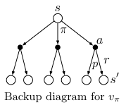

```text
Starting from state s, the root node at the top, the agent could take any of some set of actions (e.g.3) based on its policy pi. 
From each of these, the environment could respond with one of several next states, s0 (e.g.2), 
along with a reward, r, depending on its dynamics given by the function p.
```

- The action-value function $Q_\pi$ 's Bellman equation.

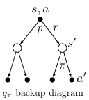

```text
If we were to take action 𝑎 in state 𝑠, what is the expected return if we then follow 𝜋 afterward?
```

### 3.2 Policy evaluation

$\color{orange}\text{Policy improvement theorem}$

Assume deterministic policy $\pi$
Policy $\pi'$ is the improvement of $\pi$ if: for any s, $Q^\pi(s, \pi') \ge V^\pi(s)$

Then $\pi \text{ and } \pi'$ satisfy: for any s, $V^{\pi'}(s) \ge V^\pi(s)$

$\color{Lime} \text{PROOF 28}$

### 3.3 Find optimal policy

#### 3.3.1 Policy iteration

Given a MDP with limited action space and state space: $|S| < \infty, |A| < \infty$

- PI based on s value V

  1. Randomly initialize policy 𝜋
  2. Repeat until convergence {
     a) Calculate 𝑉 ≔ 𝑉^𝜋 (Updating is time consuming)
     b) For each state 𝑠 ∈ 𝒮, update:

$$
\pi(s) = arg \max_a r(s,a) + \gamma \sum_{s'}P(s'|s,a)V(s')
$$

}

- PI based on action value Q

  1. Randomly initialize policy 𝜋
  2. Repeat until convergence {
     a) Calculate Q ≔ Q^𝜋 (Updating is time consuming)
     b) For each state 𝑠 ∈ 𝒮, update:

$$
\pi(s) = arg \max_a Q(s,a)
$$

}

- $\color{Lime} \text{PROOF 35,36at k}$

#### 3.3.2 Value iteration $\color{Lime} \text{+e.g.}$

**Speed up V, same for Q:**
Policy evaluation is time consuming.  But in the previous example, when the iteration of value function V is not  convergent, the derived policy is already optimal. Don’t wait until convergence!  If only one round of value  update is carried out in the  policy evaluation, and then the policy is upgraded  directly according to the updated value.

1. For each state, initialize V(s)=0
2. Repeat until convergence {
   a) For each state 𝑠 ∈ 𝒮, update:

$$
V(s) = arg \max_a r(s,a) + \gamma \sum_{s'}P(s'|s,a)V(s')
$$

}
3. Return a deterministic policy

$$
\pi(s) = arg \max_a r(s,a) + \gamma \sum_{s'}P(s'|s,a)V(s')
$$

Synchronous value iteration store two copies of value function (Update new by using old)
Asynchronous value iteration only store one copy of value function (Update new by using both old and new)

#### 3.3.3 Optimal policy $\pi^*$

In MDP with limited state and action  space, there is a policy:

$V^{\pi^*}(s)\ge V^{\pi}(s) \text{ for any s} \in S$

Optimal state value f

$$
V^{*}(s) = \max_\pi V^\pi(s) 
\\ = \max_\pi \sum_a \pi(a|s)Q^\pi(s,a) 
\\ = \max_aQ^*(s,a) 
\\ = \max_a r(s,a) + \gamma \sum_{s'}P(s'|s,a)V^*(s')
$$

Optimal action value f

$$
Q^{*}(s,a) = \max_\pi Q^\pi(s,a)
\\ = r(s,a) + \gamma \sum_{s'}P(s'|s,a)V^*(s')
\\ = r(s,a) + \gamma \sum_{s'}P(s'|s,a)\max_a Q^*(s,a)
$$

When value function is optimal, its policy is optimal:

$$
\pi^*(s) = arg \max_a r(s,a) + \gamma \sum_{s'}P(s'|s,a)V^*(s')
$$

relationship

$\color{Lime} \text{Proof: Value Iteration}$

### 3.4 Policy v.s. Value Iteration

Value iteration: greedy update method, equivalent to a round of value update in policy evaluation, and then the policy is upgraded directly according to the updated value

In policy iteration, the cost of updating value function by using Bellman equation is very large!

For MDP with small space, policy iteration usually converges quickly

For MDP with large space, value iteration is more practical, more efficient

If no state transition loop, best to use value iteration

### 3.5 Model-based method

MDP<S,A,P,r,$\gamma$>.
In real applications, 𝑃 and 𝑟 are unknown.

Need to learn the state transition probability P and reward r

$$
P(s'|s,a)=\frac{\text{\# take a under s and transfer to s'}}{\text{\# take a under s}}
$$

$$
r(s,a)= \text{avgerage } {r(s,a)^{(i)}}
$$

Algorithm

1. Randomly initialize policy 𝜋
2. Repeat untFil convergence {
   a) Execute 𝜋 in MDP, collect experienced data
   b) Use the collected experience in MDP to update the estimation of 𝑃 and 𝑟
   c) Value iteration by using the estimation of 𝑃 and 𝑟 to get new estimation of value function V
   d) Update policy 𝜋 as greedy policy according to V
   }

-: action space is too large. -> model-free

# 4 Model-free method

If a problem cannot be modeled as MDP, it is not a reinforcement learning problem.
Can be modeled does not mean that we know all the parameters.

Here comes the model-free method:

Learn value function and policy directly from experiences.

Key steps:

(1) Estimating value function (Policy evaluation)

(2) Optimizing policy (Policy improvement)/ control

2 kinds of policy learning

on-policy learning:Sampling policy and learning policy is the same!

off-policy: Sampling policy and learning policy is different!

- target policy $\pi(a|s)$: evluate value function $V^\pi(s)$ or $Q^\pi(s,a)$
- Behavior policy $\mu(a|s)$: collect data $\{s_t,a_t,r_t, s_{t+1},...,s_{T-1},a_{T-1},r_{T-1},s_T,a_T,r_T \}～\mu$
- why:
  - Balance exploration and exploitation
  - Learning policy by observing human beings or other agents
  - Experience from reusing old policies
  - Learn the optimal policy when following the policy used in exploration
  - Learn multiple policies when following one policy in exploration
  - An example of MSR research in Cambridge

#### 4.1 Monte Carlo value estimation

MC: repeated random sampling to obtain numerical results.
can only be applied to MDP with finite length (all episode has a terminate state).
learns from the complete episode: no bootstrapping

work in a fragmented (terminated) environment.

must wait for the end of the episode until the cumulative reward is  known

Steps:

1. Sampling a lot of episodes using policy $\pi$
2. For the state 𝑠 of each time step 𝑡 in each episode:Incremental counter 𝑁(𝑠) ←𝑁(𝑠) +1

   Incremental total cumulative reward 𝑀(𝑠) ←𝑀(𝑠) + 𝐺𝑡

   Value is estimated as the average of the cumulative rewards 𝑉(s)=  𝑀(𝑠)/𝑁(𝑠)
3. According to the law of large numbers: $V(s) -> V^\pi(s) \text{ as } N(s) -> \infty$

   Update 𝑉(𝑠) immediately after sampling an episode
4. For each state $𝑠_𝑡$ and its cumulative reward $g_t$

   $$
   N(s_t) \leftarrow N(s_t) +1
   \\ V(s_t) \leftarrow V(s_t) + \frac{1}{N(s_t)}(g_t-V(s_t))
   $$

   For nonn-stationary problems (that is, the environment will change over time), we can track a current average (that is, we don't consider episodes that are too long ago). Take $\alpha$ as a constant.

   $$
   V(s_t) \leftarrow V(s_t) + \alpha(g_t-V(s_t))
   $$
Analogy: You finish a whole chess game before adjusting your opinion about your opening moves.

Analysis:

The cummulative reward $g_t$ is the unbiased estimation of $V(s_t)$

 Good convergence property (This is still true when using functional  approximation)
 Insensitive to initial values
 Easy to understand and use

#### 4.2 Temporal difference

By bootstrapping, TD learns from incomplete fragment.

updates the current prediction value to make it close to  the estimated cumulative reward (untrue value).

works in a continuous (non-terminating) environment.

can do real-time learning at each step.

Steps:

1. Update value function $V(s_t)$, make it close to the estimated cummulative reward (TD target) $r_t+\gamma V(s_{t+1})$. the braket content in the $\alpha$ is the TD error.

$$
V(s_t) \leftarrow V(s_t) + \alpha(\color{green}{r_t+\gamma V(s_{t+1})}- \color{orange}V(s_t))
$$

Analysis:

Real target $r_t+\gamma V^\pi (s_{t+1})$ is the unbiased estimation of $V(s_t)$

TD target $r_t+\gamma V(s_{t+1})$ is biased, $\gamma V(s_{t+1})$ is the current estimation

TD target has a lower variance:

 Cumulative reward: depend on multi-step random action, multi-step state  transition and multi-step reward   TD target: depend on single-step random action, single-step state transition and single-step reward

 Usually more efficient than MC

 TD finally converges to $𝑉^\pi (𝑠_{𝑡+1})$ (but it is not always the case when using function approximation)

 More sensitive to initial values than MC

#### 4.3 Multi-step TD Learning

* Instead of updating based on a single reward, we update using a sum of rewards over **𝑛** steps.
* This helps balance between **speed (shorter horizon)** and **accuracy (longer horizon)**.
* It is useful when time constraints make full-episode learning impractical.
* The update rule still remains model-free because it doesn’t rely on knowing the full environment dynamics.

𝑛 step cummulative reward:

$$
g_t^{(n)}= r_\text{t}+\gamma r_\text{t+1}+...+\gamma^{n-1} R_\text{t+n-1}++\gamma^{n} R_\text{t+n}
$$

𝑛 step TD learning:

$$
V(s_t) \leftarrow V(s_t) + \alpha(g_t^{(n)}-V(s_t))
$$

#### 4.4 Off-policy MC by importance sampling

Evaluate policy 𝜋 using the cumulative rewarded generated by policy 𝜇

Cumulative reward 𝑔𝑡 should be weighted according by the importance ratio between two policies:

Multiply each segment by the importance ratio:

$$
\{s_t,a_t,r_t, s_{t+1},...,s_{T-1},a_{T-1},r_{T-1},s_T,a_T,r_T\}～\mu
\\g_t^{\pi/\mu}=\frac{\pi(a_t|s_t)}{\mu(a_t|s_t)}\frac{\pi(a_{t+1}|s_{t+1})}{\mu(a_{t+1}|s_{t+1})}...\frac{\pi(a_T|s_T)}{\mu(a_T|s_T)}g_t= \prod_{\tau = t}^T \frac{\pi (a_{\tau}|s_{\tau})}{\mu(a_{\tau}|s_{\tau})} g_t
$$

Update value function to approximate revised cumulative reward.

Cannot be used when 𝜋≠0 but 𝜇=0; and significantly increase variance.

$$
V(s_t) \leftarrow V(s_t) + \alpha(g_t^{\pi/\mu}-V(s_t))
$$

.

#### 4.4 Off-policy MC by importance sampling

TD target is weighted by the importance sampling

$$
V(s_t) \leftarrow V(s_t) + \alpha \left( \frac{\pi(a_t | s_t)}{\mu(a_t | s_t)} (r_t + \gamma V(s_{t+1})) - V(s_t) \right)
$$

Lower variance than MC importance sampling.

The policy only needs to be approximated in a single step.
.

#### 4.5 $\epsilon$ greedy policy improvement

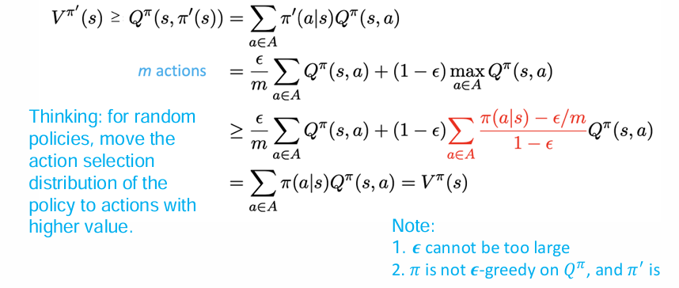

#### 4.6 Summery

Model-free RL

- On-policy MC:

  $$
  V(s_t) \leftarrow V(s_t) + \alpha (g_t - V(s_t))
  $$
- On-policy TD:

  $$
  V(s_t) \leftarrow V(s_t) + \alpha (r_t + \gamma V(s_{t+1}) - V(s_t))
  $$
- On-policy TD (SARSA):state-action-reward-state-action
  In each time step:

  $$
  Q(s_t, a_t) \leftarrow Q(s_t, a_t) + \alpha (r_t + \gamma Q(s_{t+1}, a_{t+1}) - Q(s_t, a_t))
  $$

  Policy improvement: 𝝐-greedy

  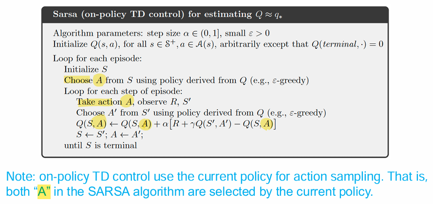
- Off-policy TD (Q-learning):

$$
Q(s_t, a_t) \leftarrow Q(s_t, a_t) + \alpha (r_t + \gamma \max_{a'} Q(s_{t+1}, a') - Q(s_t, a_t))
$$

Q learning's objective function:

t, get s_t, a_t, r_t -> Q. $\max_{a'} Q(s_{t+1},a')$ Select a', no need to sample.

$$
r_{t+1} = \gamma Q(s_{t+1}, a'_{t+1})=r_{t+1}+\gamma Q(s_{t+1}, arg \max_{a'} Q(s_{t+1},a'))=r_{t+1}+\gamma \max_{a'}Q(s_{t+1},a')
$$

efficient than SARSA

Do not need importance sampling:

* It **never explicitly computes expectations** over the target policy π, and
* It **doesn’t need to reweight samples** using importance sampling because it directly **uses the greedy action** in its update:

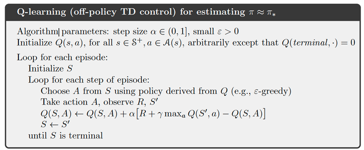

$\color{Lime} \text{PROOF Q-learning converge 52}$


# 5 Multi-step bootsrtrapping

折中4, 采样几步就更新几次，剩下的值函数估计

# 6 Value-based DRL

这一讲终于跳脱出了前面传统的强化学习（解决相对简单的问题），用神经网络拟合Q, V函数，适用于更大的状态空间。

focus on learning **how good** a state (or action) is.
We don't directly learn *what action* to take — we learn *values* first.

$\large \color{violet}\text{DQN family}$

Q-Learning: learns a function $Q_\theta(s,a)$ with para $\theta$

- given a segment {(s,a,s',r)}
- $\color{turquoise}\text{target }$ $y=r+\gamma max_\text{a'}Q_\theta(s',a')$
- update:

  $$
  Q_\theta(s,a) \leftarrow Q_\theta(s,a)+\alpha(r+\gamma \max\limits_{a'}Q_\theta(s',a')-Q_\theta(s,a))
  $$

  α后面类似梯度下降
- optimization objective:

  $$
  \theta^* \leftarrow arg \min_\theta E_\text{(s,a,s',r) ∼ U(D)} \frac{1}{2}[(r+\gamma \max\limits_{a'}Q_\theta(s',a'))-Q_\theta(s,a)]^2
  $$

  - $(r+\gamma max_\text{a'}Q_\theta(s',a')$ TD target, no gradient here???
  - $\text{(s,a,s',r) ∼ U(D)}$: a transition **(state, action, next state, reward)** is **randomly sampled** from the replay buffer D using a **uniform distribution** **U**.
  - $Q_\theta(s',a')$ 如果不固定，会连续更新，不稳定

$\color{orange}\text{Deep Q-Networks (DQN)}$ represents Q function $Q_\theta(s,a)$ by using neural networks.

- Input:s.   Not（s,a), because too large
- Last layer: a.  #of elements $|A|$
- Output:(s,a)

-:

- unstable
  - continuously sampled (s,a,s',r) is not IID
  - $Q_\theta(s',a')$ updates freq
- output is discrete (only fit for discrete action space)

sol:

- Experience replay: non IID data -> IID data
  - Store sample $e_t = (s_t, a_t, s_\text{t+1}, r_t)$ in each step of training INTO replay buffer D.
  - Sampling, uniformly distributed
- Build 2 nw:
  - Evaluations nw: $Q_\theta(s,a)$
  - Target nw $Q_{\theta^-}(s,a)$ to compute TD target: synchronize with the evaluation nw every C step

    - $\color{turquoise}\text{target }$ $y=r+\gamma \max\limits_{a'} Q_{\theta^-}(s',a')$

**Algorithm:**

1. Randomly initialize evaluation network $\theta; \theta^- \leftarrow \theta$
2. Initialize experience replay buffer D
3. Repeat until convergence{

- Get initial state $s_0$
- For each step t=0,1,...,T

  - take action $a_t$ by $\epsilon$-greedy based on $Q_\theta$
  - Get reward $r_t$ and the next state $s_{t+1}$
  - Store ($s_t, a_t, s_{t+1}, r_t$) in D
  - If D is large enough, sampling N samples $\{(s_t, a_t, s_{t+1}, r_t)\}^N_{i=1}$
  - For each sample, calculate target $y_i =r_i+ \gamma \max\limits_{a'} Q_{\theta^-}(s_{i+1},a')$
  - Update $\theta$ by minimize loss $L = \frac{1}{2N}\sum_i(y_i-Q_\theta(s_i,a_i))^2$
  - If t mod C=0, then update $\theta^- \leftarrow \theta$
    }

$\color{orange}\text{Double DQN (DDQN)}$,improved version of DQN

Due to the Jensen's inequality, max operation makes the est Q always larger than real Q value. And it will be more serious when #candidate actions increase.

$$
E[\hat Q(s,a)]=Q(s,a) \\E[\max\limits_{a} \hat Q(s,a)] \ge \max\limits_{a} Q(s,a)
$$

$$
\max\limits_{a'}Q_{\theta^-}(s',a')=Q_{\theta^{-}}(s', arg \max\limits_{a'}Q_{\theta^-}(s',a')) \\=E[R|s', arg \max\limits_{a'}Q_{\theta^-}(s',a'),{\theta^-}] \\ \ge \max(E[R|s', a_1,{\theta^-}], E[R|s', a_2,{\theta^-}],...  a_i \in A
$$

$$
\text{Where } E[\max(X_1, X_2)] \ge \max(E[X_1], E[X_2])
$$

In DDQN, $Q_\theta$ is used to select next action.

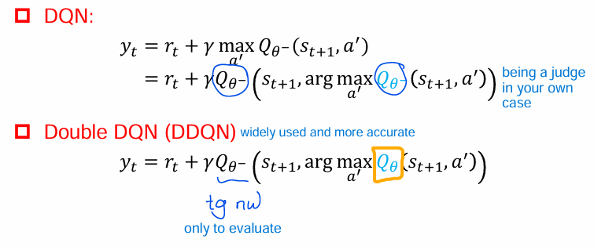

$\color{pink}\text{Prioritized Experience Replay}$ : find more experience samples

Calculate the priority $p_t$ (value of learning)

$$
p_t = |r_t + \gamma Q_{\theta^-}(s_{t+1}, arg \max\limits_{a'}Q_\theta(s_\text{t+1},a'))-Q_\theta(s_t,a_t)|
$$

Store experience $e_t = (s_t, a_t,s_\text{t+1},r_t, p_t+\epsilon)$ , $\epsilon$ is the noise for randomness, in replay buffer to give each sample a chance to be sampled.

Prob of $e_t$ being selected is $P(t)=(p_t^\alpha)/(\sum_kp_k^\alpha)$. α for smoothing. (=0 in uniform sampling)

Weight in importance sampling $w_t=(N\times P(t))^{-\beta}/(\max\limits_{i} w_i)$

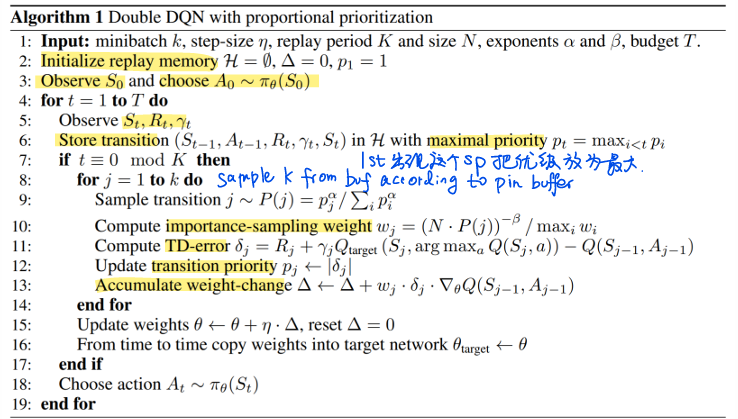

$\color{orange}\text{Dueling DQN}$, improved version of DQN. parallel with DDQN

Inputs of s are processed by CNN to extract features.

Core:Advantage funciton A

$$
A^\pi(s,a)=Q^\pi(s,a)-V^\pi(s)\\Q^\pi(s,a)=E[G_t|s,a]\\V^\pi(s)=E_{a  ∼ \pi(·|s)}[Q^\pi(s,a)]
$$

$V^\pi(s) \text{ is the avagerage value of }Q^\pi(s,a)\text{. }A^\pi(s,a) \text{ measures the effect after taking an action.}$

To obtain V, A separately (fc layer), Q in the DQN is decomposed. And they are combined into Q finally. *Subscript denotes parameters.*

$$
Q_{\theta,\alpha,\beta}(s,a) = V_{\theta,\alpha}(s)+A_{\theta,\beta}(s,a)
$$

However, this version is unstable in training because the non-uniqueness in modeling V and A.

For sol 1, max two sides of Q=V+A (max limits a only operates the f with para a), define the optimal A function($\max\limits_aA(s,a)-\max\limits_aA(s,a)$) equals to 0.

$$
Q(s,a)=V(s)+A(s,a) \\ \max\limits_aQ(s,a)=V(s)+\max\limits_aA(s,a)-\max\limits_aA(s,a)\\V(s)=\max\limits_aQ(s,a)
$$

So is the sol 2.

Therefore the two sols:

1.Set $V_{\theta,\alpha}(s)=\max\limits_{a'}Q_{\theta,\alpha,\beta}(s,a')$

$$
Q_{\theta,\alpha,\beta}(s,a) = V_{\theta,\alpha}(s)+A_{\theta,\beta}(s,a)-\max\limits_{a'}A_{\theta,\beta}(s,a')
$$

2. Set $V_{\theta,\alpha}(s)=\frac{1}{|A|}\sum_{a' \in A}Q_{\theta,\alpha,\beta}(s,a')$

$$
Q_{\theta,\alpha,\beta}(s,a) = V_{\theta,\alpha}(s)+A_{\theta,\beta}(s,a)-\frac{1}{|A|}\sum_{a' \in A}A_{\theta,\beta}(s,a')
$$

The sol ensure the uniqueness of V function,

but not satisfy with the Bellman f, the outputs of A,V,Q of the network are no longer the real A,V,Q.

We do not care of it, because the standard of doing greedy is the order of Q.

The relative order of Q remains the same. s.t.$Q(s,a_1) > Q(s,a_2) \rightarrow A(s,a_1) > A(s,a_2)$$

+ +:

  + Handle states that are less associated with actions. 没人的路上怎么开都行。
  + effective in learning state-value f: one state  value function corresponds to multiple Advantage. functions. Share the same state-value function; Easy Training, fast convergence.
#### 6.3 Challenges in Large MDPs

Maintaining a table of $V(s)$ or $Q(s,a)$ becomes infeasible in large or continuous spaces.

Solutions:
- Discretization: split continuous spaces into grids.
- Bucketing: group similar states.
- Parameterized value functions: approximate $V_\theta(s)$ or $Q_\theta(s,a)$ using models.
#### 6.4 Value Function Approximation

  ??? Approximate $V(s)$ using parameters $\theta$:

  $$Vθ(s)=θTx(s)V_\theta(s) = \theta^T x(s)Vθ(s)=θ^Tx(s)$$
  
  where:

  * $x(s)$ is a feature vector extracted from state $s$.

Objective:

$$J(\theta) = \mathbb{E}_\pi \left[\frac{1}{2}(V_\pi(s) - V_\theta(s))^2\right]$$

Gradient descent update:

$$\theta \leftarrow \theta + \alpha (V_\pi(s) - V_\theta(s)) \nabla_\theta V_\theta(s)$$

If true $V_\pi(s)$ is unknown, use Monte Carlo or TD targets instead.

  > **Advantage**: Approximation generalizes to unseen states. **Weakness**: Bad approximators can give wrong value everywhere!
  > **Analogy**: Instead of remembering every person's favorite food, you learn that *"teenagers like fast food"*. You generalize!
  

# 7 Stochastic Policy Gradient (SPG)

### 7.1 Goal
This chapter considers the neural network (parameters $\theta$) that model the stochastic policy $\pi_\theta(a|s)=\pi_\theta(a|s;\theta)$ directly, which outputs a probability distribution over actions. Notice, the final outcome here does not mean the choose the largest probability.

Value-based RL vs. policy-based RL:
	value-based: 
		visit (s,a) to find Q(s,a)
		slower (compare and find the large a col by col: $a^* = \max_\limits{a} Q(s,a)$ ), discrete A.
	policy-based:
		having s then can have a -> generalization ability (generalize the visible known state to the unknown state.)
		efficient in high-dimensional, continuous A.
		can learn stochastic policy by $\color{red}\text{stochastic policy gradient (SPG)}$.
		better convergence property but usually converges into the local minimum. Because, NN is non-convex (gradient formula), non linearity.
		inefficient in evaluation policy, and having large variance.
 
### 7.2 SPG

Stochastic policy $\pi_\theta(a|s)=\pi_\theta(a|s;\theta)=P(a|s;\theta)$
Trajectory $\tau$ is sampled by $\pi_\theta$: $\tau = \{s_0,a_0,r_0,...\}\sim \pi_\theta$ 
Total return of the $\tau$  
$$J(\pi_\theta)=E_{ \pi_\theta}[\sum_{t=0}^{\infty}\gamma^t r(S_t,A_t)]=E_{ \pi_\theta}[\sum_{t=0}^{\infty}\gamma^t r_t]$$
the policy is determined by $\theta$:
$$
\begin{aligned}
J(\theta) &= \mathbb{E}_{\tau \sim \pi_\theta(\tau)}[G(\tau)] \\
&= \mathbb{E}_{\tau \sim \pi_\theta(\tau)}\left[\sum_{t=0}^{\infty} \gamma^t r(s_t, a_t)\right] \\
&= \mathbb{E}_{\pi_\theta}\left[\sum_{t=0}^{\infty} \gamma^t r(S_t, A_t)\right] \\
&= \mathbb{E}_{(s, a) \sim \hat{\rho}^{\pi_\theta}}[r(s, a)] \\
&= \frac{1}{1 - \gamma} \mathbb{E}_{(s, a) \sim \rho^{\pi_\theta}}[r(s, a)] \\
&= \mathbb{E}_{s_0 \sim v_0}[V^{\pi_\theta}(s_0)]
\end{aligned}
$$
	where, $v_0$ is the distribution of the initial states
	
$\color{red}\text{Goal}$: Gradient ascent to maximize the $J(\theta)$

  1-step MDP:

Starting state 𝑠\~𝑑(𝑠),The MDP ends after one-step decision-making, and reward is 𝑟(𝑠,𝑎)


$$
\begin{aligned}
J(\theta) &= \mathbb{E}_{s \sim d, a \sim \pi_\theta(·|s)}[r(s,a)] \\
&= \sum_s v^{\pi_\theta}(s) \sum_a \pi_\theta(a|s)r(s,a)
\end{aligned}$$
where $v(s)$ is the stationary distribution under policy $\pi$.

Gradient: Notice, $\pi_\theta$ is a function. $\log \pi_\theta$ is a composite function.
$$\begin{aligned}
\frac{\partial \pi_\theta(a|s)}{\partial\theta} 
&= \pi_\theta(a|s) \cdot \frac{1}{\pi_\theta(a|s)} \frac{\partial \pi_\theta(a|s)}{\partial\theta} 
&& \text{(Multiply by 1 in a clever way)} \\
&= \pi_\theta(a|s) \cdot \frac{\partial \log \pi_\theta(a|s)}{\partial\theta} \cdot\frac{\partial\theta}{\partial \pi_\theta(a|s)} \cdot\frac{\partial \pi_\theta(a|s)}{\partial\theta} 
&& \text{Using } \frac{d}{dx}\log f(x) = \frac{f'(x)}{f(x)} \\
&= \pi_\theta(a|s) \cdot \nabla_\theta \log \pi_\theta(a|s)
&& \text{(Final policy gradient form)}
\end{aligned}$$

$$
\begin{aligned}
\nabla_\theta J(\theta) 
&= \sum_{s \in S} d(s) \sum_{a \in A} \frac{\partial \pi_\theta(a|s)}{\partial \theta} r(s,a) \\
&= \sum_{s \in S} d(s) \sum_{a \in A} \pi_\theta(a|s) \nabla_\theta \log \pi_\theta(a|s) r(s,a) \\
&= \mathbb{E}_{s \sim d(s), a \sim \pi_\theta(s)} \left[ \nabla_\theta \log \pi_\theta(a|s) \cdot r(s,a) \right]
\end{aligned}
$$
---
#### Policy gradient theorem

For any differential policy $\pi_\theta(a|s)$, $$\nabla_\theta J(\theta) =\mathbb{E}_{(s, a) \sim \hat{\rho}^{\pi_\theta}}\left[ \nabla_\theta \log \pi_\theta(a|s) \cdot Q^{\pi_\theta}(s,a) \right] 
\propto \mathbb{E}_{(s, a) \sim \rho^{\pi_\theta}}\left[ \nabla_\theta \log \pi_\theta(a|s) \cdot Q^{\pi_\theta}(s,a) \right]$$
Parameters are put in into the learning rate.

- policy gradient algorithm: on-policy, sampling by $\pi_\theta$
---

Go deeper into the calculation of the gradient.
The NN-implemented scoring function $$f_\theta(s,a)$$
For a stochastic policy in a discrete action problem, the probability of sampling an action is implemented by softmax:
$$
\begin{aligned}
&\pi_\theta(a|s) = \frac{e^{f_\theta(s,a)}}{\sum_{a'} e^{f_\theta(s,a')}}\\

& \log \pi_\theta(a|s) = \log e^{f_\theta(s,a)} - \log {\sum_{a'} e^{f_\theta(s,a')}}= f_\theta(s,a) - \log {\sum_{a'} e^{f_\theta(s,a')}}\\

& \nabla_\theta \log \pi_\theta(a|s) = \frac{\partial f_\theta(s,a)}{\partial} - \nabla_\theta \log {\sum_{a'} e^{f_\theta(s,a')}}
\end{aligned}
$$
$$
\begin{aligned}

\nabla_\theta \log {\sum_{a'} e^{f_\theta(s,a')}} &= \frac{1}{\sum_{a'} e^{f_\theta(s,a')}} \cdot\nabla_\theta {\sum_{a'} e^{f_\theta(s,a')}} \\

&= \frac{1}{\sum_{a''} e^{f_\theta(s,a'')}} \cdot {\sum_{a'} e^{f_\theta(s,a')}} \cdot \nabla_\theta f_\theta(s,a')\\

&= \sum_{a'}(\frac{e^{f_\theta(s,a')}}{\sum_{a''} e^{f_\theta(s,a'')}}\nabla_\theta f_\theta(s,a'))\\

&= \sum_{a'} \pi_\theta(a'|s)\nabla_\theta f_\theta(s,a')\\

&= \mathbb{E}_{a' \sim \pi_\theta(·|s)} \nabla_\theta f_\theta(s,a')
\end{aligned}
$$
So,
$$
\nabla_\theta \log \pi_\theta(a|s) =\nabla_\theta f_\theta(s,a) - \mathbb{E}_{a' \sim \pi_\theta(·|s)} \nabla_\theta f_\theta(s,a')
$$
The policy gradient theorem can be derived into:
$$
\begin{aligned}
\nabla_\theta J(\theta) &=\mathbb{E}_{(s, a) \sim \rho^{\pi_\theta}}\left[ \nabla_\theta \log \pi_\theta(a|s) \cdot Q^{\pi_\theta}(s,a) \right]\\
& = \mathbb{E}_{(s, a) \sim \rho^{\pi_\theta}}\left[ (\nabla_\theta f_\theta(s,a) - \mathbb{E}_{a' \sim \pi_\theta(·|s)} \nabla_\theta f_\theta(s,a')) \cdot Q^{\pi_\theta}(s,a) \right]

\end{aligned}
$$
The next step is to estimate the Q.

### 7.3 REINFORCE Algorithm： MC policy gradient
Cumulative reward $g_t$ to estimate $Q^{\pi_\theta} (s_t,a_t)$, by running multiple rollout (sampling multiple episode) ->  full-episode returns ->high variance, slow learning.

The variance can be reduced in some sense by the baseline $b(s)$, typically $b(s)=V_w(s)$, and it will not cause the bias. Reason:
$$
\begin{aligned}
\nabla_\theta J(\theta) &\propto \mathbb{E}_{(s, a) \sim \rho^{\pi_\theta}}[ 
\nabla_\theta \log \pi_\theta(a|s) \cdot (Q^{\pi_\theta}(s,a)-b(s))]\\

&= \mathbb{E}_{(s, a) \sim \rho^{\pi_\theta}}[\nabla_\theta\log \pi_\theta(a|s)Q^{\pi_\theta}(s,a)]
- \mathbb{E}_{(s, a) \sim \rho^{\pi_\theta}}[\nabla_\theta\log \pi_\theta(a|s)b(s)]\\

&=  \mathbb{E}_{(s, a) \sim \rho^{\pi_\theta}}[\nabla_\theta\log \pi_\theta(a|s)Q^{\pi_\theta}(s,a)] - \sum_s v^{\pi_\theta}(s) \sum_a \pi_\theta(a|s)\nabla_\theta\log \pi_\theta(a|s)b(s)\\

&=  \mathbb{E}_{(s, a) \sim \rho^{\pi_\theta}}[\nabla_\theta\log \pi_\theta(a|s)Q^{\pi_\theta}(s,a)] - \sum_s v^{\pi_\theta}(s)b(s) \sum_a \pi_\theta(a|s) \nabla_\theta\log \pi_\theta(a|s)\\

&=  \mathbb{E}_{(s, a) \sim \rho^{\pi_\theta}}[\nabla_\theta\log \pi_\theta(a|s)Q^{\pi_\theta}(s,a)] - \sum_s v^{\pi_\theta}(s)b(s) \sum_a  \nabla_\theta \pi_\theta(a|s)\\

&=  \mathbb{E}_{(s, a) \sim \rho^{\pi_\theta}}[\nabla_\theta\log \pi_\theta(a|s)Q^{\pi_\theta}(s,a)] - \sum_s v^{\pi_\theta}(s)b(s) \nabla_\theta \sum_a  \pi_\theta(a|s)\\

&=  \mathbb{E}_{(s, a) \sim \rho^{\pi_\theta}}[\nabla_\theta\log \pi_\theta(a|s)Q^{\pi_\theta}(s,a)] - \sum_s v^{\pi_\theta}(s)b(s) \nabla_\theta 1\\

&=  \mathbb{E}_{(s, a) \sim \rho^{\pi_\theta}}[\nabla_\theta\log \pi_\theta(a|s)Q^{\pi_\theta}(s,a)] - \sum_s v^{\pi_\theta}(s)b(s) \cdot0 \\

&=  \mathbb{E}_{(s, a) \sim \rho^{\pi_\theta}}[\nabla_\theta\log \pi_\theta(a|s)Q^{\pi_\theta}(s,a)]

\end{aligned}
$$
The best baseline is $V^\pi(s)$. 
	- **Implementation**: Requires learning an additional value function network (essentially forming the foundation of **Actor-Critic methods**). The critic (Vπ(s)Vπ(s)) is trained via supervised regression (e.g., MSE) to predict expected returns. 
	- **Empirical Impact**: In practice, using Vπ(s)Vπ(s) as a baseline can **reduce variance by 10× or more**, depending on task complexity and reward scaling.

#### REINFORCE (Standard Policy Gradient)
1. **Repeat until convergence**:
   - **a)** Generate an episode $\{s_0, a_0, r_0, \cdots, s_T, a_T, r_T\} \sim \pi_\theta$
   - **b)** For each step $t = 0, 1, \cdots, T$:
     - $g_t \leftarrow \sum_{\tau=t}^T \gamma^{\tau-t} r_\tau$
     - $\theta \leftarrow \theta + \alpha g_t \nabla_\theta \log \pi_\theta (a_t | s_t)$

#### REINFORCE (with b(s))
1. **Episode generation**:
   - **a)** Generate an episode $\{s_0, a_0, r_0, \cdots, s_T, a_T, r_t\} \sim \pi_\theta$
2. **For each step $t = 0, 1, \cdots, T$**:
   - $g_t \leftarrow \sum_{\tau=1}^T r^{2-\tau} t_\tau$
   - $\delta_t \leftarrow g_t - V_W(s_t)$
   - $w \leftarrow w + \alpha^w \delta_t \nabla_w V(s_t)$
   - $\theta \leftarrow \theta + \alpha^\theta \delta_t \nabla_\theta \log \pi_\theta (a_t | s_t)$
   
Still having problems: task needs to have a terminate state before REINFORCE, Low data utilization efficiency, High training variance (imp defect).

### 7.4 Actor-Critic
Build a trainable action-value function $Q_\phi$ to replace the Q estimation.
Actor network $\pi_\theta$ learns to take actions to satisfy the critic. Loss:
$$L(\phi)=\frac{1}{2} (r_t+\gamma Q_\phi(s_{t+1},a_{t+1})-Q_\phi(s_t,a_t))^2$$
Critic $Q_\phi(s,a)$ learns to accurately estimate the value function of the actions taken by policies.  Policy gradient
$$\nabla_\theta J(\theta) \propto \mathbb{E}_{(s, a) \sim \rho^{\pi_\theta}}\left[ \nabla_\theta \log \pi_\theta(a|s) \cdot Q^{\pi_\theta}(s,a) \right]$$
#### Actor-Critic Algorithm
1. **Initialize parameters**:
   - Randomly initialize policy parameters $\theta$ (Actor), $\phi$ (Critic)
1. **Repeat until convergence**:
   - a) Start from initial state $s_0$, take action $a_0 \sim \pi_\theta(\cdot|s_0)$
   - b) For each step $t = 0, 1, \cdots, T$:
     - Receive reward $r_t$ and next state $s_{t+1}$
     - Take next action $a_{t+1} \sim \pi_\theta(\cdot|s_{t+1})$
     - **Compute TD error**:
       $$\delta_t \leftarrow r_t + \gamma Q_\phi(s_{t+1}, a_{t+1}) - Q_\phi(s_t, a_t)$$
     - **Update Actor (policy)**:
       $$\theta \leftarrow \theta + \alpha \nabla_\theta \log \pi_\theta(a_t|s_t) Q_\phi(s_t, a_t)$$
     - **Update Critic (value function)**:
       $$\phi \leftarrow \phi + \beta \delta_t \nabla_\phi Q_\phi(s_t, a_t)$$
1. **Note**: This is essentially a Deep Learning version of SARSA, using the transition tuple $(s_t, a_t, r_t, s_{t+1}, a_{t+1})$. On-policy.
   It can be -> off-policy with importance sampling.
![[AC.png]]
### Advantage Actor-Critic (A2C)
Standardize critics' scores by subtracting a baseline function,
reduce the probability of poor action and improve the probability of good action,
reduce the variance, speed up convergence.

Advantage function $A^\pi = Q^\pi(s,a)-V^\pi(s)$
$$\nabla_\theta J(\theta) \propto \mathbb{E}_{(s, a) \sim \rho^{\pi_\theta}}\left[ \nabla_\theta \log \pi_\theta(a|s) \cdot A^{\pi}(s,a) \right]$$
$$
\begin{aligned}
A^\pi &= Q^\pi(s,a)-V^\pi(s)
\\ &= {r(s,a)+ \gamma E_{s'∼P(⋅∣s,a)} [V^{\pi} (s')]}-V^\pi(s)

\end{aligned}
$$
#### Training: $V^{\pi_\theta}(s) \approx V_\phi(s)$
1. **TD Error Calculation**:
   - Compute temporal difference (TD) error using current critic $V_\phi$:
     $$
     \delta_t = r_t + \gamma V_\phi(s_{t+1}) - V_\phi(s_t)
     $$
     where $s_{t+1}$ is the sampled next state.
1. **Actor Update**:
   - Update policy parameters $\theta$ using the advantage estimate:
     $$
     \nabla_\theta J(\theta) \approx \nabla_\theta \log \pi_\theta(a_t|s_t) \cdot \delta_t
     $$
     (Here $\delta_t$ serves as an estimate of the advantage function $A(s_t,a_t)$)
2. **Critic Update**:
   - Minimize the mean squared TD error:
     $$
     \mathcal{L}(\phi) = \frac{1}{2} \left( r_t + \gamma V_\phi(s_{t+1}) - V_\phi(s_t) \right)^2
     $$
![[A3C.png]]
![[A3C alg.png]]
### 7.5 TRPO (Trust Region Policy Optimization)
When the policy network is a deep model, updating the parameters along the policy gradient is likely to cause the policy to suddenly deteriorate significantly due to the long step size, affecting the training effect.

TRPO (Trust region policy optimization): Find a trust region when updating, when updating policies in this region, you can get a certain security guarantee of policy performance. Proposed in 2015. Theoretically, guarantee the monotonicity (单调性) of policy learning, and achieved better results than the policy gradient algorithm in practical application.

weakness of policy gradient: Difficult to determine a good step size. The distribution of collected data will change with the update of the policy. Poor step size has great influence.

$$
\begin{aligned}
\max_\theta \quad & \mathbb{E}_{s \sim \rho_{\pi_{\text{old}}}, a \sim \pi_{\text{old}}} \left[ \frac{\pi_\theta(a|s)}{\pi_{\text{old}}(a|s)} A^{\pi_{\text{old}}}(s, a) \right] \\\\
\text{s.t.} \quad & \mathbb{E}_{s \sim \rho_{\pi_{\text{old}}}} \left[ \text{KL}[\pi_{\text{old}}(\cdot|s) \| \pi_\theta(\cdot|s)] \right] \leq \delta
\end{aligned}
$$

Where:
- $A^{\pi_{\text{old}}}(s, a)$: Advantage function under the old policy
- $\rho_{\pi_{\text{old}}}$: State visitation distribution of the old policy
- $\delta$: Maximum allowed average KL-divergence between old and new policies
### Features
- Ensures monotonic policy improvement under mild assumptions
- Uses **second-order optimization techniques**
- Computationally more expensive due to Fisher matrix and KL constraint enforcement
### 7.6 Proximal Policy Optimization (PPO)

#### Motivation

PPO simplifies TRPO by replacing the hard trust region constraint with a **soft clipping mechanism**. It retains the benefits of stable policy updates while being much easier to implement and more computationally efficient.
#### Objective

PPO maximizes a clipped surrogate objective:

$$
L^{\text{CLIP}}(\theta) = \mathbb{E}_t \left[ \min \left( r_t(\theta) A_t, \text{clip}(r_t(\theta), 1 - \epsilon, 1 + \epsilon) A_t \right) \right]
$$

Where:
- $r_t(\theta) = \frac{\pi_\theta(a_t|s_t)}{\pi_{\text{old}}(a_t|s_t)}$: Importance sampling ratio
- $A_t$: Advantage estimate at time \( t \)
- $\epsilon$: Clipping range parameter (e.g., 0.1 or 0.2)
#### Features
- Simple first-order optimization
- Avoids large policy updates via clipping
- Strong empirical performance across many RL environments
- Often used with GAE (Generalized Advantage Estimation)
#### 🔸 Comparison

| Feature                  | TRPO                                   | PPO                                      |
|--------------------------|----------------------------------------|------------------------------------------|
| Action Space             | Continuous/Discrete                    | Continuous/Discrete                      |
| Optimization             | Constrained (Trust Region)             | Unconstrained (Clipped)                  |
| Stability                | Very High                              | High                                     |
| Efficiency               | Lower (second-order method)            | Higher (first-order gradient descent)    |
| Implementation           | Complex                                | Simple                                   |


# 8 Deterministic Policy Gradient (DPG)

### 8.1 Motivation

Sampling over all actions is inefficient in continuous spaces. A deterministic policy:

$$a = \mu_\theta(s)$$

avoids unnecessary randomness by always outputting one action for each state.

Analogy: Instead of rolling a dice to move, you deterministically step towards the goal every time.

### 8.2 Deterministic Policy Gradient Theorem

Objective:

$$J(\theta) = \mathbb{E}_{s \sim \rho_{\mu_\theta}}[Q_{\mu_\theta}(s, \mu_\theta(s))]$$

Gradient:

$$\nabla_\theta J(\theta) = \mathbb{E}_{s \sim \rho_{\mu_\theta}}\left[\nabla_\theta \mu_\theta(s) \nabla_a Q_{\mu_\theta}(s,a)\big|_{a=\mu_\theta(s)}\right]$$

This avoids integrating over the action space, making updates cheaper and faster.

### 8.3 Deep DPG (DDPG)

Combines DPG with deep networks:
- Actor: approximates $\mu_\theta(s)$
- Critic: approximates $Q_\phi(s,a)$

Training techniques:
- Experience Replay: store and reuse past experiences.
- Target Networks: slow-moving copies to stabilize learning.

DDPG is effective for high-dimensional continuous control tasks.

### 8.4 Twin Delayed DDPG (TD3)

TD3 addresses DDPG's overestimation bias.

Modifications:
- Twin Q-networks: minimize the smaller one.
- Add noise to target actions (target policy smoothing).
- Delayed actor updates.

TD3 target:

$$y = r + \gamma \min_{j=1,2} Q_{\phi_j}(s', a')$$

where $a'$ is a slightly perturbed action.

### 8.5 Advantages and Weaknesses

- Advantages:
  - Efficient for continuous action tasks.
  - More stable and less biased than basic DDPG.
- Weaknesses:
  - Requires careful tuning.
  - More computationally complex (multiple critics, delayed updates).

Mathematical reason: bias from Q-value overestimation is controlled by taking the minimum estimate, stabilizing learning.


# 9 Model-based RL
## Review: Learn an MDP Model
- **Motivation**: In real applications, the MDP model (state transition $P$ and reward function $r$) is often unknown. We need to learn it from observed episodes.
- **Key Steps**:
  1. **State Transition Probability**:  
     $$P(s'|s, a) = \frac{\text{Count}(s \rightarrow a \rightarrow s')}{\text{Count}(s \rightarrow a)}$$  
     This estimates the probability of transitioning to state $s'$ after taking action $a$ in state $s$.
  2. **Reward Function**:  
     $$r(s, a) = \text{average}\{r(s, a)^{(i)}\}$$  
     Computes the expected immediate reward for taking action $a$ in state $s$.

- **Advantages**:
  - Enables planning without direct interaction with the environment.
  - Efficient use of data by generalizing from observed transitions.
- **Weaknesses**:
  - Requires sufficient data to accurately estimate probabilities.
  - Sensitive to incomplete or noisy observations.
## 9.1 Model Classification
- **Distribution Model**: Provides all possible outcomes and their probabilities.  
  - Example: Predicting all possible sums of dice rolls.
- **Sample Model**: Generates a single outcome based on probabilities.  
  - Example: Rolling dice once to get one sum.

- **Advantages of Sample Model**: Computationally cheaper for large state spaces.
- **Weaknesses of Distribution Model**: High memory and computation requirements for complex environments.
## Planning & Learning: Introduction&Sampling&Decision-time Planning
## 9.2 Planning
- **Definition**: Planning is the process of using a model to derive a policy.
- **Types**:
  - **State-space Planning**: Searches for the optimal policy in the state space (focus of the course).
  - **Plan-space Planning**: Searches in the plan space (e.g., genetic algorithms).

- **General Framework**:
  1. Simulate experiences using the model.
  2. Update the value function using simulated data.
  3. Improve the policy based on the updated value function.

- **Example**: Dynamic Programming  
  Formula:  
  $$V(s) \leftarrow \max_a \left[ r(s, a) + \gamma \sum_{s'} P(s'|s, a) V(s') \right]$$

## 9.3 Dyna Framework
- **Integration**: Combines planning, learning, and acting.
- **Steps**:
  1. Interact with the environment to collect real experiences.
  2. Update the model using real experiences.
  3. Simulate experiences using the model.
  4. Update the value function and policy using both real and simulated experiences.

- **Algorithm: Dyna-Q**:
  1. Initialize $Q(s, a)$ and the model.
  2. Repeat:
     - Take action $a$, observe $r$ and $s'$.
     - Update $Q(s, a)$ using real experience.
     - Update the model with $(s, a, r, s')$.
     - Perform $n$ planning steps using simulated experiences.

- **Advantages**:
  - Balances exploration and exploitation.
  - Improves sample efficiency by leveraging simulated data.
- **Weaknesses**:
  - Model inaccuracies can propagate errors.
## 9.4 Sampling Methods
- **Uniform Random Sampling**: Updates all states equally, which can be inefficient.
- **Priority Sampling**: Focuses updates on states with significant value changes.
  - Formula for priority:  
    $$P \leftarrow \left| r + \gamma \max_{a'} Q(s', a') - Q(s, a) \right|$$

- **Advantages of Priority Sampling**:
  - Faster convergence by prioritizing important updates.
- **Weaknesses**:
  - Requires maintaining a priority queue, adding computational overhead.
## 9.5 Expected vs. Sample Updates
- **Expected Update**:  
  $$Q(s, a) \leftarrow \sum_{s'} P(s'|s, a) \left[ r + \gamma \max_{a'} Q(s', a') \right]$$  
  - Advantages: Accurate, unbiased.  
  - Weaknesses: Computationally expensive.

- **Sample Update**:  
  $$Q(s, a) \leftarrow Q(s, a) + \alpha \left( r + \gamma \max_{a'} Q(s', a') - Q(s, a) \right)$$  
  - Advantages: Computationally cheap.  
  - Weaknesses: Subject to sampling error.
## 9.6 Trajectory Sampling
- **Definition**: Samples trajectories based on the current policy.
- **Advantages**:
  - Focuses on relevant states.
  - Efficient for deterministic environments.
- **Weaknesses**:
  - May overfit to frequently visited states.
## Model-based Deep Reinforcement Learning
## 9.7 Model-based Deep RL (MBRL)
- **Key Questions**:
  1. How to train a deep model accurately?
  2. When to trust the model?
  3. How to use the model to improve policy training?
  4. Does the model improve data efficiency?

- **Approaches**:
  - **Model Predictive Control (MPC)**: Plans actions using the model without learning a policy.
  - **MBPO (Model-based Policy Optimization)**: Uses branched rollouts to balance model error and sample efficiency.
    - Formula for policy improvement:  
      $$\eta[\pi] \geq \hat{\eta}[\pi] - C(\epsilon_m, \epsilon_\pi)$$  
      where $C$ bounds the error due to model inaccuracies.

- **Advantages of MBRL**:
  - Higher sample efficiency than model-free methods.
- **Weaknesses**:
  - Sensitive to model errors, especially in stochastic environments.
## PETS (Probabilistic ensembles with trajectory sampling)
In this ensemble, each single model is Gaussian process built by neural networks
1. uncertainty: epistemic (model var 认知不确定性，很少数据认识不到位), aleatoric (stochastic env 环境不确定性)
2. To capture two uncertainty construct B NNs with the same network framework：Inputs are all state-action pairs, and outputs are the mean vector and covariance matrix in the next state  Their parameters are randomly initialized in different ways, and different data are randomly sampled from real data for training every time
3. Trajectory sampling: Choose one model from B NNs in each prediction  Sampling a trajectory (simulated)will use multiple environmental model. Reduce the variance.
4. Simulated data -> train the agent
## MBPO
1. Initialize policy 𝜋𝜙, predictive model 𝑃𝜃, env. Dataset 𝒟𝑒𝑛𝑣, and model dataset 𝒟𝑚𝑜𝑑𝑒𝑙 2. Repeat 𝑁 epochs { a) Train model 𝑃𝜃 on 𝒟𝑒𝑛𝑣 via maximum likelihood b) For step 𝑡=1→𝑇 { Interact with the environment by policy 𝜋𝜙 Add generated trajectories into 𝒟𝑒𝑛𝑣 For M model rollouts { Sample state 𝑠𝑡 uniformly from 𝒟𝑒𝑛𝑣 Perform 𝑘-step model rollout by PETS starting from 𝑠𝑡 using policy 𝜋𝜙 on model 𝑃𝜃 Add the generated trajectory into 𝒟𝑚𝑜𝑑𝑒𝑙 } For G gradient updates { Update policy 𝜋𝜙 by SAC on 𝒟𝑚𝑜𝑑𝑒𝑙: 𝜙←𝜙−𝜆𝜋∇𝜙𝒥𝜙;𝒟𝑚𝑜𝑑𝑒𝑙 } } }
	真实数据采集一部分，用来生成人造数据，然后训练agent
	
##  Future Directions
1. **Environment Model Learning**: Improve accuracy and generalization.
2. **Understanding Bounds**: Tighten theoretical guarantees for policy improvement.
3. **Multi-agent MBRL**: Extend to collaborative or competitive settings.

# 10 Imitation Learning
part of off-line RL.
In the complex env like autonomous driving, robotics, dialog, the reward function is difficult to design. So we need to learn straight from the expert (human driver etc), we will get the optimal strategy. Then try to get the max reward from the policy, so called inverse learning: infer reward function from demonstrations (rollouts) of expert policy.

1. Imitation Learning: 
	1. Given: demonstrations or demonstrator
	2. Goal: train a policy to mimic demonstrations
2. 状态分布一样，policy也一样。
3. 广义上，现在Learning from expert demonstration (LfD), Imitation learning, behavior cloning, inverse RL, apprenticeship learning 都属于imitation learning.
# drafts

Approximate Value Functions

- $v_\theta(s)$: approximate value of state $s$ given parameter vector $\theta$
- $q_\theta(s, a)$: approximate value of state-action pair $(s, a)$ given parameter vector $\theta$
- $\nabla v_\theta(s)$: column vector of partial derivatives of $v_\theta(s)$ with respect to $\theta$
- $\nabla q_\theta(s, a)$: column vector of partial derivatives of $q_\theta(s, a)$ with respect to $\theta$

#### Bellman Operators

- $B_\pi$: Bellman operator for value functions
- $P$: state-transition probability matrix under $\pi$
- $D$: diagonal matrix with on-policy state distribution on its diagonal
- $X$: feature matrix, with $x(s)$ as its rows
- $\Pi$: projection operator for value functions

- $\mathbb{R}$: set of real numbers
- $f : X \to Y$: function $f$ from elements of set $X$ to elements of set $Y$
- $(a, b]$: the real interval between $a$ and $b$ including $b$ but not including $a$
- $\in$: is an element of; e.g., $s \in S, r \in R$
- $\subseteq$: subset of; e.g., $R \subseteq \mathbb{R}$
- $|S|$: number of elements in set $S$

## Temporal Difference Learning

- $\delta_t$: temporal-difference (TD) error at time $t$
- $\delta_t^s, \delta_t^a$: state- and action-specific forms of the TD error
- $n$: in n-step methods, $n$ is the number of steps of bootstrapping

## Eligibility Traces

- $w, w_t$: weight vector in function approximation
- $\mathbf{w}, \mathbf{w}_t$: weight vector notation
- $x(s)$: vector of features visible in state $s$
- $x(s, a)$: vector of features visible in state $s$ taking action $a$
- $\mathbf{x}(s)$, $\mathbf{x}(s, a)$: feature vectors in bold
- $\mathbf{w}^T \mathbf{x}$: inner product of weight vector and feature vector

## Policy Gradient Methods

- $\theta, \theta_t$: parameter vector of target policy
- $\pi(a | s, \theta)$: probability of taking action $a$ in state $s$ given parameter $\theta$
- $\nabla \pi(a | s, \theta)$: gradient of policy function
- $J(\theta)$: performance measure for policy $\pi_\theta$
- $\nabla J(\theta)$: gradient of performance measure
- $b(a|s)$: behavior policy used to select actions while learning about target policy $\pi$

## Importance Sampling

- $\rho_t:h$: importance sampling ratio for time $t$ through time $h$
- $\rho_t$: importance sampling ratio for time $t$ alone, $\rho_t = \rho_{t:t}$
- $r(\pi)$: average reward (reward rate) for policy $\pi$
- $\bar{R}_t$: estimate of $r(\pi)$ at time $t$

## Norms and Errors

- $\|v\|^2_{\mu}$: $\mu$-weighted squared norm of value function $v$
- $\|\delta_t\|^2$: squared temporal-difference error
- $BE(w)$: mean square Bellman error
- $PBE(w)$: mean square projected Bellman error
- $TDE(w)$: mean square temporal-difference error

# References

1. Sutton, R.,S. & Barto, A.,G. (2018). Reinforcement learning: An introduction. (2 e.d.)
2. Lecture notes by Jianxiong Guo.
# Footnote
mutl-agent RL is not covered in this note.